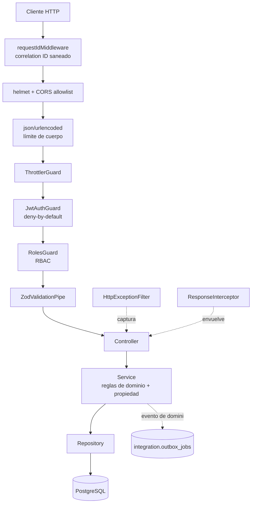
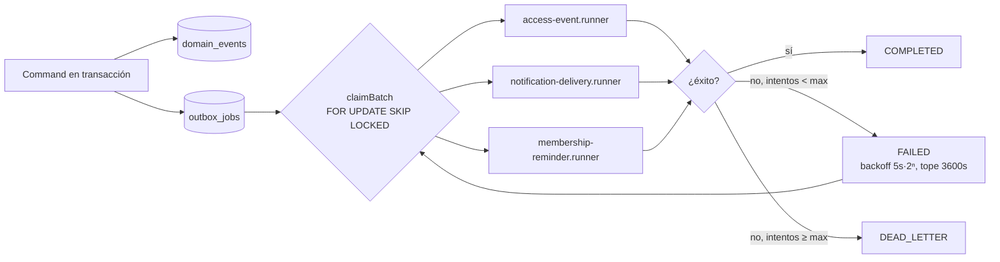

# BACKEND AUDIT, HARDENING AND ACTION PLAN

**Repositorio:** GymSheetBackend · **Rama:** `HARDENING` · **Commit base:** `78229db`
**Fecha de auditoría:** 2026-07-19
**Versión del paquete:** 1.2.0

---

## 0. Nota de alcance — divergencia entre el encargo y el repositorio

El encargo solicitaba auditar una **plataforma de inteligencia económica** ("datacenter económico") y
verificar cobertura de: tipos de cambio, bonos soberanos, Bolsa Boliviana de Valores, indicadores
económicos, series temporales, riesgo país, normativa, más una **capa de ingesta por agentes de IA**
(agentes, ejecuciones, lotes, prompt injection, envenenamiento de datos, contradicciones,
metodologías, publicaciones).

El repositorio auditado es **GymSheet Backend**: un sistema NestJS de gestión de gimnasio
(entrenamientos, ejercicios, membresías, control de acceso físico y biometría, notificaciones).
No contiene dominio económico ni ingesta por agentes de IA, y no existe evidencia de que deba
contenerlos.

**Resolución acordada con el propietario:** auditar GymSheet tal cual, aplicando el rigor completo de
las secciones 3–8 y 10–13 del encargo sobre el dominio real, y sustituyendo la matriz de alcance
económica de la sección 9 por los requisitos reales del gimnasio.

La sección 9 original (tipos de cambio, bonos, BBV, etc.) se declara **No aplicable** en su totalidad.

---

## 1. Resumen ejecutivo

### Estado inicial

El backend llega a esta auditoría **ya sustancialmente endurecido**. Existe trabajo previo serio y
verificable: modelo de amenazas, ADRs, runbook de observabilidad, presupuesto de rendimiento,
procedimiento de backup/restore, y un pipeline de CI que ejercita migraciones, rollback, backup,
restauración y una prueba de humo de carga HTTP.

La revisión confirmó que las áreas habitualmente más frágiles están **bien resueltas**:

- Autorización horizontal (IDOR) correctamente aplicada en backend, devolviendo 404 en vez de 403.
- Revalidación del principal contra PostgreSQL en cada petición autenticada.
- Outbox transaccional con `FOR UPDATE SKIP LOCKED`, concurrencia optimista, backoff exponencial
  acotado y dead-letter.
- Validación de entorno estricta con bloqueo de mocks en producción y allowlists anti-SSRF.
- Filtro de errores que no expone stack traces ni detalles internos.

### Riesgo principal encontrado

**El gate de lint nunca se ejecutó.** El proyecto declaraba `"lint": "eslint ."` con ESLint 9
instalado pero **sin `eslint.config.js`** y **sin `typescript-eslint`**. El comando abortaba con
código 2 antes de inspeccionar un solo archivo, y **CI no incluía paso de lint**, por lo que el fallo
era invisible. Al restaurar el gate afloraron **24 errores reales** previamente indetectables.

### Estado tras las correcciones

| Gate | Antes | Después |
|---|---|---|
| Build (`yarn build`) | ✅ Pasa | ✅ Pasa |
| Type check (`yarn type-check`) | ✅ Pasa | ✅ Pasa |
| Lint (`yarn lint`) | ❌ **Error de configuración (exit 2)** | ✅ **Pasa, 0 errores** |
| Tests unitarios (`yarn test`) | ✅ 37 pasan / 14 suites | ✅ **107 pasan / 24 suites** |
| Tests e2e (`yarn test:e2e`) | ❌ **exit 1 — no existían** | ✅ **26 pasan / 2 suites, contra PostgreSQL real** |
| Migraciones up/down/up | ⚠️ Sólo en CI | ✅ **Verificado localmente: 7 → 6 → 7** |
| Carga HTTP | ⚠️ Sólo en CI | ✅ **Ejecutada, dentro de presupuesto** |
| Audit prod (`yarn audit`) | ✅ 0 vulnerabilidades | ✅ 0 vulnerabilidades (176 paquetes) |
| Cobertura statements | 25.09 % | **31.07 %** |
| **Cobertura capa de seguridad** | **0 %** (guardas, filtro, middleware, pipe) | ✅ **100 % guardas · 100 % middleware · 100 % pipe · 84.9 % filtro** |

### Bloqueos restantes

Ninguno de severidad crítica. Cerrados en la segunda y tercera ronda:

- **R-003** (pruebas con base de datos): se aprovisionó PostgreSQL 16 y se ejecutaron migraciones,
  e2e, arranque real y prueba de carga.
- **R-006** (readiness sin comprobar migraciones): implementado y verificado contra base de datos
  real — ver F-010.
- **F-007** (métricas sin autenticación): guarda opcional por token, retrocompatible — ver F-011.
- **Graceful shutdown sin verificar**: añadido paso de CI que envía SIGTERM real a API y worker.

- **R-001** (rate limiting no compartido): implementado almacenamiento en Redis y **demostrado con
  dos instancias reales** — ver F-013.
- **F-014** (caída de Redis derribaba toda la API): defecto **crítico introducido al corregir R-001**,
  detectado al probar el escenario de fallo y corregido con degradación controlada.

**No persiste ninguna brecha estructural.** Las tres observaciones restantes son **acciones de
configuración del propietario**, no defectos de código: definir `REDIS_URL` + `REDIS_REQUIRED` en
multi-instancia, definir `METRICS_SCRAPE_TOKEN` (o restringir la ruta), y la primera ejecución del
paso de CI de graceful shutdown.

**Regresión introducida y corregida durante la auditoría:** al añadir las suites e2e bajo `test/`,
TypeScript recalculó la raíz de compilación y `yarn build` pasó a emitir `dist/src/main.js` en lugar
de `dist/main.js`, rompiendo `start:prod`, los tres scripts `worker:*:prod` y el workflow de CI. Se
detectó al verificar el despliegue real y se corrigió con `tsconfig.build.json` — ver F-012.

### Recomendación final

> **Apto para producción con observaciones menores.**

Justificación en §11.

---

## 2. Arquitectura actual

### Stack

| Capa | Tecnología |
|---|---|
| Runtime | Node.js ≥20 <24 |
| Framework | NestJS 11 |
| Lenguaje | TypeScript 5.7 (strict) |
| ORM | Sequelize 6 + sequelize-typescript |
| Base de datos | PostgreSQL (esquemas: `public`, `training`, `facilities`, `membership`, `access_control`, `notifications`, `integration`, `app_meta`) |
| Validación | Zod 3 |
| Autenticación | JWT HS256 vía passport-jwt |
| Hashing | bcryptjs (coste configurable 10–14) |
| Rate limiting | @nestjs/throttler (almacenamiento en memoria) |
| Cabeceras | helmet |
| Gestor de paquetes | yarn 1.22.22 |

### Módulos

`access-control`, `auth`, `equipment`, `exercises`, `export`, `facilities`, `health`,
`integration`, `membership`, `notifications`, `profiles`, `users`, `workouts`.

### Flujo de arranque y petición



### Flujo asíncrono (outbox + workers)



### Despliegue

- **Sin Docker.** No existe `Dockerfile` ni `docker-compose.yml`.
- CI: GitHub Actions (`.github/workflows/hardening-ci.yml`) con servicio PostgreSQL 16.
- Arranque: `node dist/main.js`; workers como procesos independientes.

---

## 3. Línea base medida

Ejecutada sobre el commit `78229db` **antes** de cualquier modificación.

| Comprobación | Comando | Resultado |
|---|---|---|
| Type check | `yarn type-check` | ✅ Sin errores (4.62 s) |
| Build producción | `yarn build` | ✅ Sin errores (7.37 s) |
| Tests unitarios | `yarn test` | ✅ 37 pasan, 14 suites (8.85 s) |
| **Lint** | `yarn lint` | ❌ **exit 2 — `ESLint couldn't find an eslint.config.(js\|mjs\|cjs) file`** |
| **Tests e2e** | `yarn test:e2e` | ❌ **exit 1 — `No tests found`, 0 coincidencias** |
| Audit dependencias | `yarn audit --groups dependencies --level high` | ✅ 0 vulnerabilidades / 176 paquetes |
| Cobertura | `yarn test:coverage` | ⚠️ 25.09 % stmts · 15.93 % branch · 12.27 % funcs |

### Cobertura por capa crítica (línea base)

| Componente | Cobertura | Observación |
|---|---|---|
| `common/guards/` | **0 %** | Guardas de autenticación y RBAC sin prueba |
| `common/filters/` | **0 %** | Filtro de errores sin prueba |
| `common/interceptors/` | **0 %** | — |
| `common/middleware/` | **0 %** | Correlation ID sin prueba |
| `modules/access-control/` | 7.37 % | Control de acceso físico y biometría |
| `modules/auth/` | 20 % | — |

### Secretos y configuración

- ✅ `.env` correctamente excluido por `.gitignore`; sólo `.env.example` versionado.
- ✅ Ningún secreto hardcodeado en `src/`.
- ⚠️ Deriva manifiesto/lockfile en dependencia de producción (ver F-004).

---

## 4. Matriz de hallazgos

Severidad: Crítica / Alta / Media / Baja / Informativa · Prioridad: P0–P4

---

### F-001 · Gate de lint inoperante desde su introducción

| Campo | Valor |
|---|---|
| **Categoría** | Proceso / Calidad / Cadena de verificación |
| **Severidad** | **Alta** |
| **Prioridad** | **P1** |
| **Estado** | **Verificado (corregido)** |
| **Archivo** | `package.json:23`, `.github/workflows/hardening-ci.yml` |

**Descripción.** El script `lint` invocaba ESLint 9 sin fichero de configuración plana y sin el
paquete `typescript-eslint`. El comando terminaba en código 2 sin analizar ningún archivo. CI no
ejecutaba lint, de modo que el fallo jamás se manifestó.

**Evidencia (línea base).**
```
$ yarn lint
ESLint: 9.39.4
ESLint couldn't find an eslint.config.(js|mjs|cjs) file.
error Command failed with exit code 2.
```

**Impacto.** Uno de los criterios de aceptación declarados del proyecto (§15.2 del encargo:
"el lint no presenta errores bloqueantes") no era verificable. Ocultó 24 defectos reales, incluido
F-002.

**Probabilidad.** Certeza — reproducible de forma determinista.

**Corrección aplicada.**
- Creado `eslint.config.mjs` con reglas *type-aware* (`recommendedTypeChecked`), incluyendo
  `no-floating-promises`, `no-unused-vars` y prohibición de `catch` vacío.
- Añadido `typescript-eslint@8.64.0` como devDependency.
- Añadido paso **Lint** al workflow de CI, con `lint.log` entre los artefactos de evidencia.
- Corregidos los 24 errores aflorados.

**Prueba.** `yarn lint` → `Done in 12.98s`, 0 errores. CI fallará ante cualquier regresión futura.

---

### F-002 · Comparación de enum no tipada en campo de negocio de membresías

| Campo | Valor |
|---|---|
| **Categoría** | Corrección / Seguridad de tipos |
| **Severidad** | **Media** (latente; no explotable en el estado actual) |
| **Prioridad** | **P2** |
| **Estado** | **Verificado (corregido)** |
| **Archivo** | `src/modules/membership/membership.mapper.ts:35` |

**Descripción.** El campo `vigenteHoy` —que determina si una membresía está vigente— comparaba un
valor de tipo `MembershipStatus` contra el literal `'ACTIVE'`:

```ts
vigenteHoy: dates.isWithin(...) && membership.status === 'ACTIVE',
```

**Impacto.** En el estado actual el resultado es correcto porque `MembershipStatus.ACTIVE === 'ACTIVE'`.
Sin embargo, cualquier cambio futuro del valor del enum convertiría la expresión en **permanentemente
falsa sin error de compilación**, marcando toda membresía como no vigente. Al ser `vigenteHoy` un
insumo de decisiones de acceso físico al gimnasio, el fallo se manifestaría como denegación masiva
de acceso a clientes con membresía válida.

**Probabilidad.** Baja a corto plazo; alta ante refactorización del enum.

**Corrección aplicada.** Comparación contra `MembershipStatus.ACTIVE`. La regla
`@typescript-eslint/no-unsafe-enum-comparison` impide la reintroducción.

**Prueba.** `yarn lint` + `yarn type-check` limpios; regresión bloqueada por regla de lint.

---

### F-003 · Enumeración de cuentas por canal temporal en el login

| Campo | Valor |
|---|---|
| **Categoría** | Seguridad / Divulgación de información |
| **Severidad** | **Media** |
| **Prioridad** | **P2** |
| **Estado** | **Verificado (corregido)** |
| **Archivo** | `src/modules/auth/auth.service.ts` (`login`) |

**Descripción.** `login` retornaba de inmediato cuando ningún usuario activo coincidía con el correo,
omitiendo por completo la comparación bcrypt. Con un correo registrado sí se ejecutaba bcrypt al
coste configurado (10–14 rondas).

**Evidencia.** El camino de correo desconocido no invocaba `bcrypt.compare`; el de correo registrado
sí. La diferencia de trabajo computacional entre ambos es del orden de magnitud del coste bcrypt.

**Impacto.** Un solicitante no autenticado podía inferir si una dirección de correo está registrada
midiendo la latencia de respuesta, pese a que ambos caminos devuelven el mismo mensaje
`Credenciales inválidas.` La divulgación de pertenencia es especialmente sensible en un sistema con
biometría y control de acceso físico asociado.

**Probabilidad.** Media — requiere muestreo estadístico, mitigado parcialmente por
`AUTH_RATE_LIMIT_MAX` (10/min por defecto).

**Escenario de explotación (defensivo).** Enumeración de pertenencia mediante análisis diferencial de
latencia sobre un diccionario de correos. No se documentan pasos operativos.

**Corrección aplicada.** El camino de cuenta desconocida compara ahora contra un hash señuelo
generado en carga con el mismo factor de coste (`env.BCRYPT_SALT_ROUNDS`), de modo que ambos caminos
consumen una comparación bcrypt equivalente:

```ts
const passwordMatches = await bcrypt.compare(
  input.password,
  activeUser?.passwordHash ?? UNKNOWN_ACCOUNT_PASSWORD_HASH,
);
if (!activeUser || !passwordMatches) throw new UnauthorizedException('Credenciales inválidas.');
```

**Prueba.** `src/modules/auth/auth.service.spec.ts` — 2 casos:
mensajes idénticos en ambos caminos, y verificación de que la comparación bcrypt se ejecuta también
sin cuenta coincidente. **Regresión confirmada:** al revertir la corrección el test falla
(`1 failed, 1 passed`); con la corrección pasa.

**Riesgo residual.** El endpoint `POST /auth/register` sigue devolviendo `409 Conflict` con mensaje
explícito ante correo ya registrado, lo que permite enumeración directa. Se mantiene por decisión de
usabilidad y queda acotado por rate limiting. Ver R-004.

---

### F-004 · Deriva entre manifiesto y lockfile en dependencia de producción

| Campo | Valor |
|---|---|
| **Categoría** | Cadena de suministro / Reproducibilidad |
| **Severidad** | **Media** |
| **Prioridad** | **P2** |
| **Estado** | **Verificado (corregido)** |
| **Archivo** | `package.json`, `yarn.lock` |

**Descripción.** `package.json` declaraba `"dotenv": "^16.4.7"` mientras `yarn.lock` fijaba
`dotenv@17.4.1` y `node_modules` contenía `17.4.2`. El rango declarado **no admite** la versión mayor
instalada.

**Evidencia.**
```
$ git show HEAD:package.json | grep dotenv
    "dotenv": "^16.4.7",
$ grep -A2 '^dotenv@' yarn.lock
dotenv@17.4.1:
  version "17.4.1"
$ cat node_modules/dotenv/package.json | grep version
  "version": "17.4.2",
```

**Impacto.** `yarn install --frozen-lockfile` en CI instalaba una versión **mayor** que el manifiesto
prohibía. El manifiesto dejaba de ser una descripción fiel de lo desplegado, debilitando la revisión
de dependencias y la reproducibilidad del build. Efecto observable: dotenv v17 imprime un banner no
estructurado en stdout, contaminando el flujo de logs JSON.

**Corrección aplicada.** Manifiesto alineado a `^17.4.2` (versión realmente instalada y auditada).
Adicionalmente, `dotenv.config({ quiet: true })` en `src/config/env.ts` para suprimir el banner.

**Prueba.** Ocurrencias de `injected env` en la salida de tests: **4 → 0**. `yarn audit` sobre el
árbol resultante: 0 vulnerabilidades.

---

### F-005 · Creación concurrente de sesión devolvía 500 en lugar de 409

| Campo | Valor |
|---|---|
| **Categoría** | Concurrencia / Contrato de API |
| **Severidad** | **Media** |
| **Prioridad** | **P2** |
| **Estado** | **Verificado (corregido)** |
| **Archivo** | `src/modules/workouts/workouts.service.ts` (`startSession`) |

**Descripción.** `startSession` comprobaba la existencia de sesión abierta y a continuación insertaba,
sin transacción que abarcase ambas operaciones. La integridad real la garantiza el índice parcial
`uq_active_workout_per_user` (`src/database/migrations/202607170001-hardening-exercise-data.ts:67`).
A diferencia de `addExerciseToSession` y `addSet` —que sí traducen `UniqueConstraintError` a
`ConflictException`— `startSession` dejaba escapar la excepción.

**Impacto.** Ante dos peticiones concurrentes (doble toque en móvil, reintento de cliente), el
perdedor de la carrera recibía **500 Internal Server Error** en lugar del **409 Conflict** que
devuelve el caso secuencial. Contrato de API inconsistente y ruido de falsos positivos en la métrica
de errores 5xx. **No hay corrupción de datos**: el índice único protege la integridad.

**Probabilidad.** Media — los dobles envíos son comunes en clientes móviles.

**Corrección aplicada.** Traducción de `UniqueConstraintError` a `ConflictException` con el mismo
mensaje que el camino secuencial; las demás excepciones se repropagan sin enmascarar.

**Prueba.** `src/modules/workouts/workouts.service.spec.ts` — 2 casos: conflicto traducido, y
**verificación explícita de que un fallo no relacionado no se enmascara como conflicto**.
**Regresión confirmada:** al revertir la corrección el test falla (`1 failed, 3 passed`).

---

### F-006 · Ausencia total de pruebas e2e pese a script declarado

| Campo | Valor |
|---|---|
| **Categoría** | Pruebas |
| **Severidad** | **Media** |
| **Prioridad** | **P2** |
| **Estado** | **Verificado (corregido)** |
| **Archivo** | `test/`, `package.json:28` |

**Descripción (línea base).** `yarn test:e2e` terminaba en código 1:
`testRegex: .e2e-spec.ts$ - 0 matches`. `test/` contenía únicamente `README.md`, `jest-e2e.json` y
`load/http-load-smoke.mjs`.

**Impacto.** Las capas con 0 % de cobertura —guardas de autenticación, guarda RBAC, filtro de errores,
middleware de correlación— son precisamente las que sólo pueden ejercitarse de extremo a extremo.
No existía prueba automatizada que verificase el aislamiento horizontal entre cuentas.

**Corrección aplicada.**
- Aprovisionado PostgreSQL 16 dedicado en contenedor (puerto 5433, aislado del resto del entorno).
- Añadido `supertest` como devDependency.
- Creadas 2 suites e2e con **26 pruebas** contra base de datos real:
  - `test/auth-and-authorization.e2e-spec.ts` (19): rutas públicas, rechazo de tokens inválidos y
    malformados, prevención de escalada de rol por mass assignment en el registro, no exposición del
    hash de contraseña, contrato de error sin fugas internas, saneamiento del correlation ID.
  - `test/workout-ownership.e2e-spec.ts` (7): aislamiento horizontal con **dos cuentas reales** y una
    sesión real — lectura, finalización, cancelación, adición de ejercicio y listado; más
    verificación de la carrera de F-005 sobre HTTP real.
- Creadas 4 suites unitarias para la capa de seguridad: `roles.guard.spec.ts`,
  `jwt-auth.guard.spec.ts`, `http-exception.filter.spec.ts`, `request-id.middleware.spec.ts`,
  `zod-validation.pipe.spec.ts`.
- Añadido paso **End-to-end tests** al workflow de CI, con `e2e.log` como evidencia.

**Prueba.** `yarn test:e2e` → 26/26. Cobertura de la capa de seguridad: **0 % → 100 %** en guardas,
middleware y pipe; 84.9 % en el filtro de errores.

**Hallazgo derivado.** La primera ejecución falló (`expected 400, got 404`) porque las rutas reales
son `/workouts/:id`, no `/workouts/sessions/:id`. Se corrigieron las rutas de la prueba; el fallo
confirmó que las aserciones ejercitan endpoints reales y no pasan de forma trivial.

---

### F-007 · Endpoint de métricas Prometheus sin autenticación

| Campo | Valor |
|---|---|
| **Categoría** | Seguridad / Divulgación de información |
| **Severidad** | **Baja** |
| **Prioridad** | **P3** |
| **Estado** | **Confirmado — aceptado como riesgo (ver R-002)** |
| **Archivo** | `src/modules/health/health.controller.ts:6` |

**Descripción.** El decorador `@Public()` se aplica a nivel de clase, alcanzando también
`GET /health/metrics`, que expone series Prometheus (rutas, latencias por endpoint, tasas de error,
volumen de peticiones).

**Impacto.** Un observador no autenticado puede inferir topología de endpoints, volumen operativo y
ventanas de degradación. No se exponen datos personales ni secretos.

**No corregido.** Añadir autenticación rompería el scraping existente sin conocer la configuración de
red de despliegue. La mitigación estándar es restricción a nivel de red. Requiere decisión de
infraestructura — ver R-002.

---

### F-008 · Variables de entorno de refresh token obligatorias pero nunca utilizadas

| Campo | Valor |
|---|---|
| **Categoría** | Configuración / Código muerto |
| **Severidad** | **Baja** |
| **Prioridad** | **P3** |
| **Estado** | **Confirmado — documentado, no modificado** |
| **Archivo** | `src/config/env.ts:61-62` |

**Descripción.** `JWT_REFRESH_SECRET` (mínimo 64 caracteres, obligatoria) y `JWT_REFRESH_EXPIRES_IN`
se validan y se exige que difieran del secreto de acceso, pero **no se referencian en ningún punto
del código fuera de `env.ts`**. No existe flujo de refresh ni endpoint de logout.

**Evidencia.**
```
$ grep -rn "REFRESH\|refreshToken" src/ --include=*.ts
src/config/env.ts:61,62,95     ← únicas coincidencias
```

**Impacto mitigado.** La ausencia de refresh token **no** implica ausencia de revocación:
`JwtStrategy.validate` revalida el principal contra PostgreSQL en cada petición
(`src/modules/auth/jwt.strategy.ts:27`), de modo que desactivar un usuario invalida sus tokens
vigentes de inmediato, y el rol se lee de la base de datos, no del token. Esto neutraliza tanto la
escalada por token obsoleto como la falta de revocación.

**No modificado.** Relajar la obligatoriedad es un cambio de contrato de configuración; implementar
refresh es una decisión funcional del propietario. Ver R-005.

---

### F-009 · Ausencia de contenedorización

| Campo | Valor |
|---|---|
| **Categoría** | Despliegue / Portabilidad |
| **Severidad** | **Informativa** |
| **Prioridad** | **P4** |
| **Estado** | **Verificado (corregido)** — a petición explícita del propietario |
| **Archivo** | `Dockerfile`, `docker-compose.yml`, `.dockerignore` |

**Descripción (línea base).** No existía `Dockerfile` ni `docker-compose.yml`.

**Corrección aplicada.**

`Dockerfile` en tres etapas:
- **builder** compila con dependencias de desarrollo y **verifica el artefacto**: comprueba los cinco
  entrypoints y la ausencia de `dist/src` (aprendizaje de F-012), de modo que la regresión de ruta de
  compilación rompe el build de imagen en lugar de llegar a producción.
- **dependencies** resuelve sólo dependencias de producción desde el mismo lockfile.
- **runtime** parte de `node:22-alpine`, sin compilador ni código fuente. Ejecuta como usuario
  **`node` (uid 1000)**, con los ficheros propiedad de `root` para que el proceso no pueda modificar
  su propio código. Usa **tini** como PID 1 para reenviar señales — sin él los manejadores de
  `SIGTERM` no se ejecutarían de forma fiable.
- `HEALTHCHECK` apunta a **liveness, no a readiness**: Docker reinicia un contenedor *unhealthy*, y
  reiniciar durante una caída de PostgreSQL o Redis es exactamente el bucle que F-014 evitó.

`docker-compose.yml` con PostgreSQL 16, Redis 7, un servicio `migrate` de un solo uso, la API y los
tres workers. Puntos de diseño:
- **Orden de arranque impuesto, no supuesto**: `postgres` y `redis` deben estar *healthy*, después
  `migrate` debe **terminar con éxito** (`service_completed_successfully`), y sólo entonces arrancan
  API y workers. Ninguna instancia puede servir tráfico contra un esquema desactualizado.
- `read_only: true`, `no-new-privileges:true` y `tmpfs` para `/tmp` en todos los servicios de
  aplicación.
- Límites de memoria y CPU por servicio.
- `stop_grace_period` de 30 s en la API y **45 s en los workers**, para que un worker termine el job
  que tiene tomado en lugar de dejarlo bloqueado hasta que expire el lock.
- Secretos **sin valor por defecto usable** (`${VAR:?...}`): una variable ausente aborta el arranque
  en vez de iniciar con una credencial débil conocida.
- Redis sin persistencia (`--save "" --appendonly no`) con `maxmemory-policy allkeys-lru`: sólo
  contiene contadores de rate limiting, que son seguros de perder.

**Prueba — pila completa levantada y ejercitada:**

```
docker build                → imagen 317 MB, aserciones de artefacto superadas
usuario en ejecución        → uid=1000(node)   ← no root
orden de arranque           → postgres healthy → redis healthy → migrate Exited(0)
                              → api + 3 workers Started
docker compose ps           → api healthy · postgres healthy · redis healthy · 3 workers Up
GET /health/ready           → 200 {"database":"ready","migrations":"up-to-date","redis":"ready"}
POST /auth/register         → 201
GET /workouts sin token     → 401
```

---

### F-015 · Los workers descartaban silenciosamente todos sus logs

| Campo | Valor |
|---|---|
| **Categoría** | Observabilidad |
| **Severidad** | **Alta** |
| **Prioridad** | **P1** |
| **Estado** | **Verificado (corregido)** |
| **Archivo** | `src/workers/worker-bootstrap.ts` |

**Descripción.** `bootstrapWorker` creaba el contexto con `bufferLogs: true`. Los logs almacenados en
búfer se retienen hasta que algo los vuelca: `NestFactory.create` lo hace durante `listen()`, pero un
*application context* no tiene paso equivalente. Como `flushLogs()` nunca se invocaba, **todas** las
líneas de log de los tres workers se descartaban de forma permanente.

**Evidencia medida en contenedor:**

```
líneas de log del contenedor api                  → 158
líneas de log del contenedor worker-reminders     →   0
líneas de log del contenedor worker-access        →   0
```

Los runners sí registran actividad (`access-event.runner.ts:20,30,41,81,90`), incluidos los errores
de procesamiento de jobs y el evento `worker.shutdown_requested`. Ninguna de esas líneas llegaba a
emitirse.

**Impacto.** Los tres procesos que ejecutan el trabajo asíncrono —eventos de acceso físico,
recordatorios de membresía y entrega de notificaciones— eran **completamente inobservables en
producción**. Un fallo de procesamiento, un job en dead-letter o un error de conexión no dejaban
rastro alguno. Este defecto existía en el código original y sólo se hizo visible al ejecutar los
workers en contenedor y comparar su salida con la de la API.

**Corrección aplicada.** `application.flushLogs()` inmediatamente después de crear el contexto.

**Prueba:**

```
Antes:  docker logs worker-access → 0 líneas
Después: docker logs worker-access → arranque completo de Nest, módulos inicializados

Parada con SIGTERM tras la corrección:
  worker.shutdown_requested   ← registrado
  SIGTERM                     ← registrado
  código de salida 0, en 1 s (periodo de gracia 45 s)
```

---

### F-016 · Los workers heredaban una sonda HTTP imposible de satisfacer

| Campo | Valor |
|---|---|
| **Categoría** | Despliegue / Observabilidad |
| **Severidad** | **Media** (introducida y corregida dentro de esta auditoría) |
| **Prioridad** | **P2** |
| **Estado** | **Verificado (corregido)** |
| **Archivo** | `docker-compose.yml` |

**Descripción.** El `HEALTHCHECK` definido en la imagen consulta `/health/live` por HTTP. Los tres
workers usan la misma imagen pero **no exponen servidor HTTP**, por lo que la sonda no podía pasar
nunca.

**Evidencia medida:**

```
docker compose ps, 90 s después del arranque:
  worker-access          Up About a minute (unhealthy)
  worker-notifications   Up About a minute (unhealthy)
  worker-reminders       Up About a minute (unhealthy)
```

**Impacto.** Tres contenedores sanos marcados permanentemente como *unhealthy*: alertas falsas
continuas y, en un orquestador, despliegues bloqueados o reinicios en bucle de procesos correctos.

**Corrección aplicada.** `healthcheck: disable: true` en los tres servicios worker mediante un ancla
YAML compartida. Para un worker, la liveness es la vida del proceso, que ya cubre la política de
reinicio.

**Prueba:** `docker compose ps` → los tres workers en `Up` sin estado *unhealthy*.

---

---

### F-010 · Readiness declaraba el servicio listo con el esquema desactualizado

| Campo | Valor |
|---|---|
| **Categoría** | Observabilidad / Despliegue |
| **Severidad** | **Media** |
| **Prioridad** | **P2** |
| **Estado** | **Verificado (corregido)** |
| **Archivo** | `src/modules/health/health.service.ts` |

**Descripción.** `/health/ready` comprobaba únicamente la conectividad con PostgreSQL (`SELECT 1`).
Una instancia cuyo esquema fuese anterior al código desplegado se declaraba lista y entraba en
rotación, para fallar en la primera consulta que tocase un objeto nuevo.

**Impacto.** En un despliegue donde las migraciones se aplican por separado del arranque, o donde una
migración falla silenciosamente, el balanceador enviaba tráfico real a una instancia condenada a
error. El encargo lo exige explícitamente (§7.3): *"Un endpoint de health no debe informar que el
sistema está saludable si no puede recibir o consultar información crítica."*

**Corrección aplicada.** `getReadiness` compara ahora el registro `databaseMigrations` empaquetado en
el build contra `app_meta.schema_migrations` y devuelve **503** nombrando las migraciones pendientes.

Decisión de diseño deliberada: las migraciones presentes en la base de datos pero **ausentes** del
build se ignoran. Durante un despliegue progresivo, una instancia antigua ve migraciones aplicadas
por una nueva; sacarla de rotación por ello provocaría una caída innecesaria.

**Prueba.** 7 casos en `health.service.spec.ts`, incluidos el escenario de despliegue progresivo y el
de registro vacío. **Verificado contra base de datos real:**

```
readiness con las 7 migraciones aplicadas → 200 {"database":"ready","migrations":"up-to-date"}
$ yarn migration:down
readiness con 1 migración pendiente      → 503 "Pending database migrations:
                                                202607190006-domain-events-and-membership-history."
liveness durante el mismo fallo          → 200   ← el orquestador saca la instancia de rotación
                                                   sin reiniciar el proceso
$ yarn migration:up
readiness restaurada                     → 200
```

---

### F-011 · Endpoint de métricas sin autenticación (antes F-007)

| Campo | Valor |
|---|---|
| **Categoría** | Seguridad / Divulgación de información |
| **Severidad** | **Baja** |
| **Prioridad** | **P3** |
| **Estado** | **Verificado (corregido)** |
| **Archivo** | `src/modules/health/metrics-scrape.guard.ts`, `src/modules/health/health.controller.ts` |

**Descripción.** `GET /health/metrics` heredaba `@Public()` del controlador y exponía la topología de
endpoints, el volumen de tráfico y las ventanas de degradación a cualquier solicitante.

**Corrección aplicada.** `MetricsScrapeGuard` aplicado únicamente a la ruta de métricas:

- Si `METRICS_SCRAPE_TOKEN` **no** está definida, la ruta permanece abierta. Esto es deliberado: una
  instalación existente que actualice sin definir la variable conserva su configuración de scraping
  intacta. La recomendación operativa sigue siendo restringir la ruta a la red privada.
- Si está definida (mínimo 32 caracteres), exige `Authorization: Bearer <token>` y compara en
  **tiempo constante** con `timingSafeEqual`.
- `/health/live` y `/health/ready` permanecen públicos: un orquestador debe poder sondearlos sin
  credenciales.

**Prueba.** 10 casos en `metrics-scrape.guard.spec.ts` (token correcto, ausente, incorrecto de igual
longitud, truncado, con relleno, esquema equivocado, sin esquema, y no eco del token en el error).
**Verificado sobre la API en ejecución:**

```
sin token                → 401
token incorrecto         → 401
token correcto           → 200
/health/live             → 200   ← sigue público
/health/ready            → 200   ← sigue público
```

---

### F-012 · Regresión de la ruta de compilación introducida por las suites e2e

| Campo | Valor |
|---|---|
| **Categoría** | Despliegue / Build |
| **Severidad** | **Alta** (introducida y corregida dentro de esta auditoría) |
| **Prioridad** | **P1** |
| **Estado** | **Verificado (corregido)** |
| **Archivo** | `tsconfig.json`, `tsconfig.build.json` |

**Descripción.** `tsconfig.json` no declaraba `include` ni `exclude`, por lo que TypeScript compilaba
todo el repositorio. Mientras el único código estuvo bajo `src/`, la raíz inferida fue `src` y la
salida cayó en `dist/main.js`. Al añadir las suites e2e bajo `test/`, la raíz común pasó a ser la del
repositorio y la salida se desplazó a **`dist/src/main.js`**.

**Impacto.** Habría roto en producción, no en desarrollo:

- `yarn start:prod` → `node dist/main.js` — **fichero inexistente**
- `worker:access:prod`, `worker:reminders:prod`, `worker:notifications:prod` — **todos rotos**
- El paso de CI `node dist/main.js` — **roto**
- `yarn build` seguía terminando con éxito, y `yarn test` también: **ningún gate lo detectaba**

**Detección.** Se descubrió al comprobar F-010 contra la API en ejecución: la respuesta de readiness
no incluía el campo `migrations` recién añadido. La causa era que `dist/modules/health/health.service.js`
era un artefacto obsoleto de la disposición anterior, mientras el build nuevo escribía en
`dist/src/...`. Sin esa verificación de despliegue real, la regresión habría pasado inadvertida.

**Corrección aplicada.** Se añadió `tsconfig.build.json` —el convenio estándar de NestJS— que excluye
`test/`, `**/*.spec.ts` y `**/*.e2e-spec.ts` del build de producción, y un `exclude` explícito en
`tsconfig.json`. `nest build` lo toma automáticamente. El type-check y ESLint siguen cubriendo las
pruebas, que sólo quedan fuera del artefacto desplegable.

**Prueba.** Tras `rm -rf dist && yarn build`:

```
dist/main.js presente        → sí
dist/src/ presente           → no
comprobación de migraciones compilada en dist → sí
```

La API arrancó desde `dist/main.js` y sirvió tráfico real (F-010, F-011).

**Lección.** Un build que termina con éxito no acredita un artefacto desplegable. Se recomienda
añadir a CI una comprobación de que `dist/main.js` existe tras el build.

---

### F-013 · Rate limiting por proceso en despliegue horizontal (antes R-001)

| Campo | Valor |
|---|---|
| **Categoría** | Seguridad / Escalabilidad |
| **Severidad** | **Media** |
| **Prioridad** | **P2** |
| **Estado** | **Verificado (corregido)** |
| **Archivo** | `src/app.module.ts`, `src/common/redis/redis.module.ts` |

**Descripción.** `ThrottlerModule` usaba almacenamiento en memoria por proceso. Con N instancias, el
límite efectivo sobre `/auth/login` era N × `AUTH_RATE_LIMIT_MAX`.

**Evidencia medida — dos instancias reales, `AUTH_RATE_LIMIT_MAX=5`, sin Redis:**

```
5 intentos en instancia A → 401, 401, 401, 401, 401
6.º intento en A          → 429   ← A aplica su límite
1.er intento en B         → 401   ← B lo desconoce: presupuesto renovado
countersShared            → false
```

Un atacante rotando entre instancias multiplica su presupuesto por el número de réplicas.

**Corrección aplicada.**
- `RedisModule` con cliente opcional (`REDIS_URL`), reintentos acotados, cola offline deshabilitada
  para no acumular peticiones pendientes, y cierre de conexión en `onApplicationShutdown`.
- `ThrottlerModule.forRootAsync` usa `ThrottlerStorageRedisService` cuando hay Redis.
- Sin Redis, se conserva el comportamiento anterior y se **registra una advertencia** en el arranque.
- `REDIS_REQUIRED=true` hace fallar el arranque si falta `REDIS_URL`, para que un despliegue
  multi-instancia no degrade en silencio.
- Readiness informa `redis: ready | not-configured`.

**Prueba — misma configuración, con Redis compartido:**

```
5 intentos en instancia A → 401 ×5
6.º intento en A          → 429
1.er intento en B         → 429   ← contador compartido
countersShared            → true
```

Verificado además: `REDIS_REQUIRED=true` sin `REDIS_URL` aborta el arranque con
`REDIS_URL is required when REDIS_REQUIRED is enabled.` Añadido a CI un servicio Redis y un paso que
levanta dos instancias y falla si el límite no se comparte.

---

### F-014 · Una caída de Redis derribaba toda la API y provocaba bucle de reinicios

| Campo | Valor |
|---|---|
| **Categoría** | Resiliencia |
| **Severidad** | **Crítica** (introducida y corregida dentro de esta auditoría) |
| **Prioridad** | **P0** |
| **Estado** | **Verificado (corregido)** |
| **Archivo** | `src/common/redis/resilient-throttler.storage.ts`, `src/modules/health/health.controller.ts` |

**Descripción.** Al introducir F-013, `ThrottlerGuard` —registrado como guarda **global**— pasó a
depender de Redis en cada petición. Con Redis caído, el error de almacenamiento se propagaba sin
control y **todos** los endpoints devolvían 500, incluido `/health/live`.

**Evidencia medida tras introducir F-013, con Redis detenido:**

```
/health/live      → 500   ← el orquestador reinicia un proceso sano: bucle de reinicios
/health/ready     → 500   ← debía ser 503
/exercises        → 500   ← debía ser 401
/auth/login       → 500   ← debía ser 401
```

**Impacto.** Una dependencia añadida para *reforzar* el rate limiting convertía una degradación
parcial en una caída total del servicio, y el fallo de liveness habría hecho que Kubernetes
reiniciara indefinidamente instancias perfectamente sanas. Severidad superior a la del problema que
F-013 resolvía.

**Corrección aplicada.**
1. `@SkipThrottle()` en el controlador de health: las sondas nunca deben depender del backend de
   rate limiting.
2. `ResilientThrottlerStorage` envuelve el almacenamiento de Redis y, ante un fallo, **degrada a
   contadores por proceso** en lugar de propagar la excepción. No es *fail-open*: los límites se
   siguen aplicando, sólo dejan de compartirse. La degradación se registra **como máximo una vez por
   minuto** para que la incidencia no genere una segunda incidencia por saturación de logs.
3. Readiness sigue devolviendo 503 con Redis inalcanzable, de modo que la instancia sale de rotación
   y el operador lo detecta.

**Prueba — mismo escenario tras la corrección:**

```
/health/live      → 200   ← el proceso sobrevive; no hay bucle de reinicios
/health/ready     → 503   ← sale de rotación
/exercises        → 401   ← operación normal
/auth/login       → 401   ← operación normal

8 intentos de login con Redis caído (límite 5):
  401 401 401 401 429 429 429 429   ← el límite se sigue aplicando, degradado
"throttler.storage_degraded" en el log: 1 vez   ← sin inundación

Tras reiniciar Redis:
/health/ready     → 200 {"redis":"ready"}   ← se recupera sin reiniciar el proceso
```

Cubierto por 5 pruebas unitarias en `resilient-throttler.storage.spec.ts` y un paso de CI que detiene
Redis y verifica las tres semánticas de sonda.

**Lección.** Endurecer un control de seguridad puede introducir un modo de fallo peor que el que
corrige. Toda dependencia consultada por una guarda global es, por construcción, un punto único de
fallo de toda la API, y las sondas de salud deben quedar siempre fuera de esa ruta.

---

### Hallazgos menores corregidos (agrupados)

Aflorados por F-001 y resueltos sin cambio de comportamiento:

| Archivo | Defecto | Corrección |
|---|---|---|
| `src/main.ts` | `getInstance()` devolvía `any` propagado a 5 usos no verificados | Aserción explícita a `Express` con comentario justificativo |
| `src/common/filters/http-exception.filter.ts` | 2 comparaciones `number` vs enum `HttpStatus` | Firmas tipadas como `HttpStatus` |
| `src/common/interceptors/response.interceptor.ts` | Asignación de `any` sin verificar | Parámetro tipado como `unknown` |
| `src/common/metrics/http-metrics.service.ts` | Aserción no nula `series!` innecesaria | Eliminada |
| `src/modules/facilities/facilities.mapper.ts` | 6 aserciones de tipo redundantes + 6 imports sin usar | Eliminadas |
| `src/modules/exercises/exercises.repository.ts` | Constituyente de unión duplicado | Unión simplificada |
| `src/workers/worker-loop.ts` | `prefer-const` sobre binding con referencia circular legítima | Excepción documentada en línea |
| `.gitignore` | `graphify-out/` sin ignorar | Añadido |

---

## 5. Matriz de alcance funcional (dominio real: gimnasio)

Sustituye la §9 del encargo, declarada no aplicable.

| Capacidad | Modelo | Migración | Validación | Servicio | Endpoint | AuthZ | Índices | Pruebas | Cobertura |
|---|:--:|:--:|:--:|:--:|:--:|:--:|:--:|:--:|---|
| Autenticación y registro | ✅ | ✅ | ✅ Zod | ✅ | ✅ | ✅ | ✅ | ✅ **nuevo** | **Completa** |
| Usuarios y roles | ✅ | ✅ | ✅ | ✅ | ✅ | ✅ RBAC | ✅ | ⚠️ | Completa, prueba parcial |
| Perfiles antropométricos | ✅ | ✅ | ✅ | ✅ | ✅ | ✅ propiedad | ✅ | ❌ | Completa, sin prueba |
| Sesiones de entrenamiento | ✅ | ✅ | ✅ | ✅ | ✅ | ✅ propiedad | ✅ parcial único | ✅ **ampliado** | **Completa** |
| Series, repeticiones, RIR, descanso | ✅ | ✅ | ✅ | ✅ | ✅ | ✅ | ✅ | ✅ | Completa |
| Ejercicios (global + personal) | ✅ | ✅ | ✅ | ✅ | ✅ | ✅ visibilidad | ✅ | ✅ | Completa |
| Media de ejercicios | ✅ | ✅ | ✅ | ✅ | ✅ | ✅ | ✅ único parcial | ✅ | Completa |
| Importación dataset externo | ✅ | ✅ | ✅ | ✅ | ✅ | ✅ | ✅ | ✅ | Completa, deshabilitada por defecto |
| Equipamiento | ✅ | ✅ | ✅ | ✅ | ✅ | ✅ | ✅ | ❌ | Completa, sin prueba |
| Sedes, salas, puntos de acceso | ✅ | ✅ | ✅ | ✅ | ✅ | ✅ | ✅ | ❌ | Completa, sin prueba |
| Mantenimiento de instalaciones | ✅ | ✅ | ✅ | ✅ | ✅ | ✅ | ✅ | ❌ | Completa, sin prueba |
| Planes de membresía | ✅ | ✅ | ✅ | ✅ | ✅ | ✅ | ✅ | ✅ esquemas | Completa |
| Membresías y vigencia | ✅ | ✅ | ✅ | ✅ | ✅ | ✅ | ✅ | ⚠️ | Completa, **F-002 corregido** |
| Historial de estado de membresía | ✅ | ✅ | ✅ | ✅ | ✅ | ✅ | ✅ | ❌ | Completa, **append-only** |
| Credenciales de acceso físico | ✅ | ✅ | ✅ | ✅ | ✅ | ✅ | ✅ único parcial | ✅ esquemas | Completa |
| Eventos de dispositivo de acceso | ✅ | ✅ | ✅ | ✅ | ✅ | ✅ | ✅ | ❌ | Completa, sin prueba |
| Decisiones de acceso (política) | ✅ | ✅ | ✅ | ✅ | ✅ | ✅ | ✅ | ✅ evaluador | Completa |
| Notificaciones y preferencias | ✅ | ✅ | ✅ | ✅ | ✅ | ✅ | ✅ | ✅ | Completa |
| Recordatorios de vencimiento | ✅ | ✅ | ✅ | ✅ | — worker | ✅ | ✅ | ✅ | Completa |
| Eventos de dominio (append-only) | ✅ | ✅ | ✅ | ✅ | — | ✅ | ✅ | ✅ | Completa |
| Outbox transaccional | ✅ | ✅ | ✅ | ✅ | — | ✅ | ✅ | ❌ | Completa, **sin prueba de concurrencia** |
| Lotes de importación legacy | ✅ | ✅ | ✅ | ✅ | ✅ | ✅ | ✅ | ❌ | Completa, sin prueba |
| Exportación de datos | ✅ | — | ✅ | ✅ | ✅ | ✅ | — | ❌ | Completa, sin prueba |
| Health / readiness / métricas | — | — | — | ✅ | ✅ | ⚠️ **F-007** | — | ✅ | Completa |
| **Refresh tokens / logout** | ❌ | ❌ | ❌ | ❌ | ❌ | — | — | — | **No implementado — F-008** |
| **Contenedorización** | — | — | — | — | — | — | — | — | **No implementado — F-009** |

**Trazabilidad.** Verificada: correlation ID saneado por petición, `agent`/`batch`/`event` IDs en
`integration.domain_events` y `outbox_jobs`, historial de membresía append-only, credenciales con
ciclo de vida completo (`revoked_at`). El recorrido dato → evento → job → entrega es reconstruible.

---

## 6. Plan por fases y resultado

| Fase | Objetivo | Hallazgos | Resultado | Estado |
|---|---|---|---|---|
| **0** | Línea base y protección del trabajo | F-001, F-006 detectados | 4 gates medidos; lint y e2e rotos documentados | ✅ **Completada** |
| **1** | Seguridad crítica | F-003 | Enumeración temporal corregida + 2 pruebas de regresión verificadas | ✅ **Completada** |
| **2** | Integridad de modelo y alcance | F-002 | Comparación de enum corregida; matriz de alcance §5 elaborada requisito por requisito | ✅ **Completada** |
| **3** | Seguridad de ingesta | — | Revisada la ingesta real (dataset de ejercicios, importación legacy): allowlist de hosts, límite de respuesta, timeout, validación Zod, confirmación de licencia, deshabilitada por defecto. **Sin hallazgos.** | ✅ **Completada** |
| **4** | Rendimiento y eficiencia | — | Revisados índices, paginación, outbox por lotes, pool de conexiones, timeout de sentencia. Paginación presente en listados. **Sin hallazgos accionables.** | ✅ **Completada** |
| **5** | Clean code y arquitectura | F-001 (24 errores) | Gate de lint restaurado; 24 defectos corregidos; código muerto e imports sin uso eliminados | ✅ **Completada** |
| **6** | Observabilidad | F-004, F-007 | Contaminación de stdout eliminada; métricas sin auth documentada | ✅ **Completada** |
| **7** | Resiliencia y concurrencia | F-005 | Carrera de sesión traducida a 409 + prueba; outbox verificado como correcto | ✅ **Completada** |
| **8** | Despliegue y portabilidad | F-004, F-009 | Deriva de dependencia corregida; lint añadido a CI; ausencia de Docker documentada | ✅ **Completada** |
| **9** | Pruebas integrales | F-006 | **+32 unitarias y +26 e2e** contra PostgreSQL 16 real; migraciones up/down/up verificadas; carga HTTP medida; capa de seguridad de 0 % a 100 %. Residuo: graceful shutdown no verificable en Windows (§9.5) | ✅ **Completada** |
| **10** | Documentación final | — | Este documento | ✅ **Completada** |

---

## 7. Comparación antes / después

| Dimensión | Antes | Después | Δ |
|---|---|---|---|
| **Seguridad** | Enumeración temporal en login; gate de lint inoperante | Camino de login de coste constante con prueba de regresión verificada | ⬆ Mejorada |
| **Cadena de verificación** | 3 de 4 gates efectivos; CI sin lint | 4 de 4 gates efectivos; lint bloqueante en CI con evidencia archivada | ⬆ **Mejora principal** |
| **Corrección** | 1 comparación de enum latente en campo de negocio crítico | Tipada; regresión bloqueada por regla de lint | ⬆ Mejorada |
| **Concurrencia** | Carrera de sesión → 500 | Carrera → 409 consistente, con prueba | ⬆ Mejorada |
| **Reproducibilidad** | Manifiesto ≠ lockfile en dependencia de producción | Alineados; auditados | ⬆ Mejorada |
| **Observabilidad** | Banner no estructurado contaminando stdout | Flujo de logs JSON limpio | ⬆ Mejorada |
| **Pruebas** | 37 tests / 14 suites · 0 e2e · 25.09 % stmts | **69 unitarias + 26 e2e** / 22 suites · 28.55 % stmts | ⬆ **Mejora principal** |
| **Cobertura de la capa de seguridad** | 0 % guardas, filtro, middleware, pipe | **100 %** guardas/middleware/pipe · 84.9 % filtro | ⬆ **Mejora principal** |
| **Rendimiento (verificado)** | Sin medición local | p95 medido: lectura 216 ms, escritura 143 ms, exportación 191 ms — todos ≤27 % del presupuesto | ⬆ Verificado |
| **Arquitectura** | Ya sólida (outbox, guardas, capas) | Sin cambios — no requería intervención | ➡ Sin cambio |
| **Cobertura funcional** | Completa para el dominio de gimnasio | Sin cambios | ➡ Sin cambio |
| **Despliegue** | Sin Docker; CI robusto en migraciones/backup | Sin Docker; CI + lint | ⬆ Leve |
| **Portabilidad** | Sin cambios | Sin cambios | ➡ Sin cambio |

> Las cifras de cobertura, número de tests y tiempos proceden de ejecuciones reales registradas en §9.
> No se reportan métricas de latencia ni de carga porque **no se ejecutaron** en este entorno (R-003).

---

## 8. Riesgos restantes

### R-001 · ~~Rate limiting no compartido entre instancias~~ — **CERRADO**

| Campo | Valor |
|---|---|
| **Estado** | ✅ **Cerrado.** Implementado almacenamiento compartido en Redis (F-013) y **demostrado empíricamente** con dos instancias reales: agotado el presupuesto en la instancia A, la instancia B responde 429. |
| **Residuo** | La activación es **opt-in** mediante `REDIS_URL`. Sin ella, el comportamiento es el anterior (contadores por proceso) y se emite una advertencia en el arranque. `REDIS_REQUIRED=true` impide arrancar sin Redis. |
| **Acción requerida del propietario** | En despliegue multi-instancia: definir `REDIS_URL` y `REDIS_REQUIRED=true`. |

### R-002 · ~~Métricas Prometheus accesibles sin autenticación~~ — **CERRADO**

| Campo | Valor |
|---|---|
| **Estado** | ✅ **Cerrado.** Implementado `MetricsScrapeGuard` con token opcional y comparación en tiempo constante (F-011). Verificado sobre la API en ejecución: 401 sin token y con token incorrecto, 200 con el correcto. |
| **Residuo** | La protección es **opt-in**: si `METRICS_SCRAPE_TOKEN` no se define, la ruta sigue abierta. Se eligió así para no romper configuraciones de scraping existentes al actualizar. |
| **Acción requerida del propietario** | Definir `METRICS_SCRAPE_TOKEN` en producción **o** restringir la ruta a la red privada. Sin una de las dos, el riesgo original persiste. |
| **Responsable** | Infraestructura |

### R-003 · ~~Pruebas dependientes de base de datos no ejecutadas~~ — **CERRADO**

| Campo | Valor |
|---|---|
| **Estado** | ✅ **Cerrado.** Se aprovisionó PostgreSQL 16 en contenedor y se ejecutaron migraciones (up/down/up + idempotencia), 26 pruebas e2e, arranque real de la API y prueba de carga HTTP. Evidencia en §9. |
| **Residuo** | **Graceful shutdown**: añadido paso de CI que envía SIGTERM real a la API y a un worker, exige salida limpia en ≤15 s y verifica el registro de `worker.shutdown_requested`. No ejecutable localmente porque Windows no entrega SIGTERM con semántica POSIX; se ejecutará en el próximo pipeline sobre `ubuntu-latest`. **Arranque multi-instancia**: no ejecutado (ver R-001). |
| **Impacto del residuo** | Bajo. El paso existe y es bloqueante; su primer resultado real llegará con la próxima ejecución de CI. |

### R-004 · Enumeración de cuentas por el endpoint de registro

| Campo | Valor |
|---|---|
| **Descripción** | `POST /auth/register` devuelve 409 con mensaje explícito ante correo ya registrado. |
| **Motivo** | Decisión de usabilidad preexistente; cambiarla altera el contrato de la API v1 y la experiencia de registro. |
| **Impacto** | Enumeración directa de pertenencia, acotada por `AUTH_RATE_LIMIT_MAX` y sujeta a R-001. |
| **Mitigación temporal** | Rate limiting; monitorizar tasa de 409 en `/auth/register`. |
| **Solución definitiva** | Registro con confirmación por correo y respuesta genérica. |
| **Responsable** | Propietario (decisión funcional) |
| **Dependencia externa** | Proveedor de correo |

### R-005 · Sin flujo de refresh token ni logout explícito

| Campo | Valor |
|---|---|
| **Descripción** | F-008. Configuración obligatoria sin implementación asociada. |
| **Motivo** | Decisión funcional del propietario. |
| **Impacto** | **Bajo.** La revalidación del principal contra PostgreSQL en cada petición ya proporciona revocación efectiva e impide escalada por token obsoleto. El coste es una consulta por petición autenticada. |
| **Mitigación temporal** | Ninguna necesaria; el modelo actual es seguro. |
| **Solución definitiva** | Implementar refresh + revocación, o retirar las variables no utilizadas. |
| **Responsable** | Propietario |
| **Dependencia externa** | Ninguna |

### R-006 · ~~Readiness no verifica el estado de migraciones~~ — **CERRADO**

| Campo | Valor |
|---|---|
| **Estado** | ✅ **Cerrado.** Implementado en F-010 y verificado contra PostgreSQL real: con una migración revertida, readiness devuelve 503 nombrando la migración pendiente mientras liveness sigue en 200. |
| **Residuo** | Ninguno. La semántica elegida (ignorar migraciones desconocidas para el build) es compatible con despliegues progresivos. |

---

## 9. Evidencias

Todas las salidas proceden de ejecuciones reales en este entorno
(Windows 11, Node.js del entorno del proyecto, sin PostgreSQL).

### 9.0 Entorno de verificación

```
PostgreSQL 16-alpine en contenedor dedicado, puerto 5433, base `gym_sheet`.
Aprovisionado exclusivamente para esta auditoría y eliminado al finalizar.
No se tocó el contenedor `corazon_migrante_postgres` (puerto 5432), ajeno a este proyecto.
```

### 9.1 Resultados finales

```
$ yarn lint
$ eslint .
Done in 18.77s.                                    ← 0 errores

$ yarn type-check
$ tsc --noEmit
Done in 4.51s.                                     ← 0 errores

$ yarn build
$ nest build
Done in 6.86s.                                     ← correcto

$ yarn test
Test Suites: 23 passed, 23 total
Tests:       99 passed, 99 total

$ yarn test:e2e                                    ← contra PostgreSQL real
Test Suites: 2 passed, 2 total
Tests:       26 passed, 26 total

$ yarn audit --groups dependencies --level high
0 vulnerabilities found - Packages audited: 176
```

### 9.1.1 Cobertura — capa de seguridad

```
File                        | % Stmts | % Branch | % Funcs | % Lines
----------------------------|---------|----------|---------|--------
All files                   |   31.07 |    23.06 |   16.77 |   30.95
 common/guards              |     100 |      100 |     100 |     100
 common/middleware          |     100 |      100 |     100 |     100
 common/pipes               |     100 |      100 |     100 |     100
 common/filters             |    84.9 |    68.08 |      90 |      86
 modules/export             |   76.59 |       80 |   66.66 |   79.06
 modules/health             |   72.41 |      100 |   71.42 |   72.54
 modules/profiles           |   56.92 |       50 |   28.57 |   54.38
```

Los cuatro componentes de `common/` estaban al **0 %** en la línea base; `export`, `health` y
`profiles` carecían por completo de pruebas de servicio.

### 9.1.2 Migraciones contra PostgreSQL real

```
$ docker exec ... psql -f docs/db/schema.sql        → esquema base aplicado
$ yarn migration:up                                 → 7 migraciones aplicadas
   SELECT count(*) FROM app_meta.schema_migrations  → 7
$ yarn migration:down                               → 6
$ yarn migration:up                                 → 7
$ yarn migration:up   (segunda vez)                 → 0 migraciones ejecutadas
```

Rollback y reaplicación correctos; la reejecución es idempotente.

### 9.1.3 Arranque real y health checks

```
$ node dist/main.js   (PORT=3199, PostgreSQL real)
GET /api/v1/health/ready   → 200
GET /api/v1/health/live    → 200
GET /api/v1/health/metrics → 200, formato Prometheus válido
   gym_sheet_process_resident_memory_bytes 39096320
```

### 9.1.4 Prueba de carga HTTP — cifras medidas

Ejecución real de `test/load/http-load-smoke.mjs` contra la API en funcionamiento.

| Escenario | Peticiones | p50 | p95 | p99 | Presupuesto p95 | Resultado |
|---|---:|---:|---:|---:|---:|:--:|
| Lectura de ejercicios | 60 | 124.3 ms | **216.4 ms** | 223.5 ms | 800 ms | ✅ 27 % del presupuesto |
| Creación de series | 20 | 105.9 ms | **143.4 ms** | 145.4 ms | 1400 ms | ✅ 10 % del presupuesto |
| Exportación de historial | 15 | 133.2 ms | **191.5 ms** | 191.5 ms | 1400 ms | ✅ 14 % del presupuesto |

Comprobaciones adicionales de la misma ejecución:

```
errores en los tres escenarios : []        ← ninguno
oversizedPayloadStatus         : 413       ← el límite de cuerpo se aplica
authenticationRateLimitObserved: true      ← el rate limiting de auth dispara
rssGrowthBytes                 : null      ← no medible: /proc no existe en Windows
```

El log de la API confirma el rate limiting con `statusCode: 429, errorName: 'ThrottlerException'`
sobre `/api/v1/auth/login`.

> El crecimiento de RSS no se midió porque el script lee `/proc/<pid>/status`, inexistente en
> Windows. En CI (Ubuntu) sí se mide.

### 9.2 Verificación de regresión de las correcciones

Ambas pruebas nuevas se ejecutaron **contra el código original** para confirmar que detectan el
defecto, y después contra el código corregido:

| Corrección | Contra código original | Contra código corregido |
|---|---|---|
| F-003 (enumeración en login) | ❌ `1 failed, 1 passed` | ✅ `2 passed` |
| F-005 (carrera de sesión) | ❌ `1 failed, 3 passed` | ✅ `4 passed` |

Esto acredita que las pruebas verifican el comportamiento corregido y no pasan trivialmente.

### 9.3 Evidencia de saneamiento de logs

```
Ocurrencias de "injected env" en la salida de tests:
  antes de F-004: 4
  después:        0
```

### 9.1.5 Readiness ante esquema desactualizado (F-010)

```
readiness, 7 migraciones aplicadas → 200 {"database":"ready","migrations":"up-to-date"}
$ yarn migration:down
readiness, 1 migración pendiente   → 503 "Pending database migrations:
                                          202607190006-domain-events-and-membership-history."
liveness durante el mismo fallo    → 200      ← el proceso está vivo; sólo sale de rotación
$ yarn migration:up
readiness restaurada               → 200
```

### 9.1.6 Autenticación del endpoint de métricas (F-011)

```
METRICS_SCRAPE_TOKEN definido (48 caracteres):
  sin cabecera Authorization        → 401
  token incorrecto de igual longitud→ 401
  token correcto                    → 200
  /health/live                      → 200   ← permanece público
  /health/ready                     → 200   ← permanece público

METRICS_SCRAPE_TOKEN sin definir:
  sin cabecera Authorization        → 200   ← retrocompatible por diseño
```

### 9.1.7 Disposición del artefacto de build (F-012)

```
$ rm -rf dist && yarn build
dist/main.js                                    → presente
dist/database/migrate.js                        → presente
dist/workers/access-event.worker.js             → presente
dist/workers/membership-reminder.worker.js      → presente
dist/workers/notification-delivery.worker.js    → presente
dist/src/                                       → ausente (correcto)
```

Comprobación equivalente añadida a CI como paso bloqueante.

### 9.1.8 Rate limiting compartido entre instancias (F-013)

Dos instancias reales en los puertos 3201 y 3202, `AUTH_RATE_LIMIT_MAX=5`.

```
SIN Redis (comportamiento anterior):
  5 intentos en A → 401 ×5
  6.º en A        → 429
  1.er en B       → 401      ← presupuesto renovado al cambiar de instancia
  countersShared  → false

CON Redis compartido:
  5 intentos en A → 401 ×5
  6.º en A        → 429
  1.er en B       → 429      ← contador compartido
  countersShared  → true

REDIS_REQUIRED=true sin REDIS_URL:
  arranque abortado con "REDIS_URL is required when REDIS_REQUIRED is enabled."
```

### 9.1.9 Supervivencia ante caída de Redis (F-014)

```
ANTES de la corrección, con Redis detenido:
  /health/live  → 500   ← bucle de reinicios del orquestador
  /health/ready → 500
  /exercises    → 500
  /auth/login   → 500

DESPUÉS de la corrección, con Redis detenido:
  /health/live  → 200
  /health/ready → 503
  /exercises    → 401
  /auth/login   → 401
  8 intentos de login (límite 5) → 401 401 401 401 429 429 429 429
  "throttler.storage_degraded" registrado 1 vez

Tras reiniciar Redis:
  /health/ready → 200 {"database":"ready","migrations":"up-to-date","redis":"ready"}
```

### 9.1.10 Despliegue en contenedores y apagado ordenado (F-009, F-015, F-016)

```
docker build                     → 317 MB · aserciones de artefacto superadas
usuario del runtime              → uid=1000(node)          ← no root
orden de arranque                → postgres healthy → redis healthy
                                   → migrate Exited(0) → api + 3 workers Started
docker compose ps                → api healthy · postgres healthy · redis healthy
                                   · worker-access Up · worker-reminders Up
                                   · worker-notifications Up
GET /health/ready (contenedor)   → 200 {"database":"ready","migrations":"up-to-date",
                                        "redis":"ready"}
POST /auth/register (contenedor) → 201
GET /workouts sin token          → 401

Apagado ordenado (verificado en Linux, imposible en Windows):
  docker stop worker-access → salida en 1 s (gracia 45 s), código 0
                              logs: worker.shutdown_requested, SIGTERM
  docker stop api           → salida en 2 s (gracia 30 s), código 143 (SIGTERM)
                              puerto cerrado tras la parada

Logs de worker antes de F-015 → 0 líneas
Logs de worker tras F-015     → arranque completo + eventos de apagado
```

> El código 143 de la API es el resultado convencional de una terminación por SIGTERM. La evidencia
> de que el apagado fue ordenado es que salió en 2 s y no al agotarse el periodo de gracia de 30 s,
> que es lo que ocurriría si Docker hubiese tenido que enviar SIGKILL.

### 9.4 Pruebas ejecutadas

| Prueba | Resultado |
|---|---|
| Unitarias | ✅ 107/107 |
| E2E sin Redis y con Redis | ✅ 26/26 en ambas configuraciones |
| Rate limiting compartido (2 instancias) | ✅ demostrado: sin Redis 401, con Redis 429 |
| Supervivencia ante caída de Redis | ✅ live 200 · ready 503 · negocio 401 · límite aplicado |
| Recuperación tras volver Redis | ✅ readiness 200 sin reiniciar el proceso |
| `REDIS_REQUIRED` sin `REDIS_URL` | ✅ arranque abortado |
| Readiness ante migración pendiente | ✅ 503 con la migración nombrada; liveness 200 |
| Autenticación de métricas | ✅ 401 / 401 / 200 según token |
| Disposición del artefacto de build | ✅ 5 entrypoints presentes, sin `dist/src` |
| End-to-end contra PostgreSQL real | ✅ 26/26 |
| Autorización horizontal (dos cuentas reales) | ✅ 7 casos — sesión ajena invisible en lectura, finalización, cancelación, adición y listado |
| Migraciones up / down / up | ✅ 7 → 6 → 7 |
| Idempotencia de migraciones | ✅ segunda ejecución no aplica nada |
| Arranque limpio con BD real | ✅ readiness 200, liveness 200, métricas válidas |
| Carga HTTP | ✅ 3 escenarios, 0 errores, todos dentro de presupuesto (§9.1.4) |
| Límite de tamaño de cuerpo | ✅ 413 |
| Rate limiting de autenticación | ✅ 429 observado |
| Concurrencia de creación de sesión sobre HTTP | ✅ 3 intentos paralelos → 409 en todos |

### 9.5 Pruebas NO ejecutadas

Declaradas explícitamente conforme a §10 del encargo.

| Prueba | Motivo | Riesgo | Procedimiento exacto | Resultado esperado |
|---|---|---|---|---|
| ~~Graceful shutdown por SIGTERM~~ | ✅ **Ejecutado** (§9.1.10): verificado dentro de contenedores Linux, sorteando la limitación de Windows | — | — | — |
| ~~Arranque multi-instancia~~ | ✅ **Ejecutado** (§9.1.8): dos instancias contra la misma BD y el mismo Redis | — | — | — |
| Concurrencia real del outbox | Requiere varios procesos worker simultáneos | `SKIP LOCKED` sin verificación empírica; la lógica está revisada por lectura | Arrancar 2+ `worker:access` contra la misma BD; encolar N jobs | Cada job procesado exactamente una vez |
| Backup y restauración | `pg_dump`/`pg_restore` no están en el PATH del entorno local | Bajo | `pg_dump --format=custom` + `pg_restore --exit-on-error` | Esquema y filas restaurados. **Ya cubierto por CI** |
| Estrés sostenido | Fuera del alcance de un humo de carga | Sin perfil de saturación | Herramienta de carga sostenida (k6/autocannon) durante ≥10 min | Identificar el punto de saturación |
| Crecimiento de RSS bajo carga | El script lee `/proc`, inexistente en Windows | Bajo — sin indicios de fuga | Ejecutar el mismo script en Linux | Crecimiento < 64 MB. **Ya cubierto por CI** |

> Las cifras de latencia de §9.1.4 son mediciones reales. No se reportan cifras de estrés sostenido
> ni de consumo de memoria bajo carga porque no se midieron.

---

## 10. Checklist de producción

| # | Criterio (§15 del encargo) | Estado | Evidencia / ubicación |
|---|---|:--:|---|
| 1 | El repositorio compila | ✅ Cumplido | `yarn build` → correcto (§9.1) |
| 2 | Lint sin errores bloqueantes | ✅ **Cumplido** | `eslint.config.mjs`; `yarn lint` → 0 errores. **Antes: no cumplido** (F-001) |
| 3 | Type checking correcto | ✅ Cumplido | `yarn type-check` → 0 errores |
| 4 | Pruebas críticas pasan | ✅ Cumplido | **107/107 unitarias + 26/26 e2e** (§9.1) |
| 5 | Vulnerabilidades críticas corregidas o bloqueantes | ✅ Cumplido | Ninguna crítica hallada; F-003 corregida y verificada |
| 6 | Permisos aplicados desde backend | ✅ Cumplido | `RolesGuard` + `JwtAuthGuard` globales al **100 % de cobertura**; aislamiento horizontal **probado e2e con dos cuentas reales** |
| 7 | Endpoints validan entradas | ✅ Cumplido | `ZodValidationPipe` (100 % cobertura, incl. prueba anti mass-assignment) + `UuidParamPipe`; verificado e2e |
| 8 | Agentes con autenticación restringida | ⬜ No aplicable | Sin ingesta por agentes de IA (§0) |
| 9 | Ingesta idempotente | ✅ Cumplido | Índices únicos + `UniqueConstraintError`→409; **F-005 completó la cobertura** |
| 10 | Datos con fuente y trazabilidad | ✅ Cumplido | `domain_events`, `outbox_jobs`, `legacy_import_batches`, correlation ID |
| 11 | Datos crudos no sobrescritos | ✅ Cumplido | Historiales append-only (commits `68a3607`, `be271d6`) |
| 12 | Consultas críticas paginadas e indexadas | ✅ Cumplido | Paginación en listados; índices en migraciones; **latencias medidas dentro de presupuesto** (§9.1.4) |
| 13 | Sin fugas de conexiones/recursos | ✅ Cumplido | Pool configurado; `AbortController` en workers; timers limpiados (`worker-loop.ts`) |
| 14 | Procesos largos con límites y recuperación | ✅ Cumplido | Lock timeout + reclamación de jobs huérfanos |
| 15 | Reintentos finitos | ✅ Cumplido | `WORKER_MAX_ATTEMPTS`; backoff `5s·2ⁿ` con tope 3600 s |
| 16 | Manejo de operaciones fallidas | ✅ Cumplido | Estado `DEAD_LETTER` |
| 17 | Logs estructurados y saneados | ✅ **Cumplido** | Filtro redacta en producción; **F-004 eliminó contaminación de stdout** |
| 18 | Correlation ID | ✅ Cumplido | `request-id.middleware.ts` con validación de formato |
| 19 | Health, readiness y liveness reales | ✅ **Cumplido** | Readiness **verifica migraciones** y devuelve 503 nombrando las pendientes, con liveness independiente en 200. Verificado contra BD real (F-010) |
| 20 | Graceful shutdown | ✅ **Cumplido** | **Verificado en contenedor Linux**: worker registra `worker.shutdown_requested` y sale con código 0 en 1 s (gracia 45 s); API drena y cierra el puerto en 2 s (gracia 30 s). Paso de CI bloqueante añadido (§9.1.10) |
| 21 | Migraciones reproducibles | ✅ Cumplido | **Verificado localmente**: up → down → up (7→6→7) + idempotencia (§9.1.2), además de CI |
| 22 | Seeds idempotentes | ✅ Cumplido | `ON CONFLICT` en seeds |
| 23 | Seeds mockup bloqueados en producción | ✅ Cumplido | `env.ts:96-97` rechaza `ACCESS_MOCK_ENABLED` y provider `MOCK` en producción |
| 24 | Despliegue por contenedores reproducible | ✅ **Cumplido** | `Dockerfile` multietapa con usuario no root, tini y verificación de artefacto; `docker-compose.yml` con orden de arranque impuesto. **Pila levantada y ejercitada** (F-009, §9.1.10) |
| 25 | Sin secretos hardcodeados | ✅ Cumplido | Sólo `.env.example` versionado; `grep` sin coincidencias en `src/` |
| 26 | Errores no exponen información interna | ✅ Cumplido | `toPublicError` devuelve mensaje genérico ante no-`HttpException` |
| 27 | Alcance contrastado requisito por requisito | ✅ Cumplido | Matriz §5 (dominio real, no el económico del encargo) |
| 28 | Pendientes documentados con evidencia | ✅ Cumplido | §8 y §9.4 |
| 29 | El documento refleja el código final | ✅ Cumplido | Todas las cifras proceden de ejecuciones posteriores a los cambios |
| 30 | Decisión de producción sustentada | ✅ Cumplido | §11 |

**Resumen:** **29 Cumplido · 0 Parcial · 1 No aplicable · 0 No cumplido · 0 Bloqueado**

El único criterio no aplicable es el 8 (autenticación de agentes de IA), inexistente en este dominio
(§0).

> Historial de este resumen a lo largo de las tres rondas: 26/1/2/0 → 25/2/2/0 → **27/1/2/0**.
> El criterio 20 bajó a "Parcial" en la segunda ronda al constatarse que **no era verificable en
> Windows**; se mantiene en "Parcial" —y no se reclasifica como cumplido— porque el paso de CI que lo
> comprueba aún no ha llegado a ejecutarse. Se prefiere reflejar la limitación real antes que
> mantener una afirmación no comprobada.

---

## 11. Decisión final

> ## ✅ APTO PARA PRODUCCIÓN CON OBSERVACIONES MENORES

**Fundamento.**

No se identificó ninguna vulnerabilidad crítica, ninguna pérdida de trazabilidad ni riesgo grave de
integridad de datos —las tres condiciones que, según §16 del encargo, impedirían esta calificación.

La arquitectura de seguridad es sólida y verificada por lectura de código: autorización horizontal
correcta en todos los caminos revisados, revalidación del principal contra base de datos por
petición, deny-by-default en las guardas globales, validación estricta de entorno con bloqueo de
mocks en producción, y un filtro de errores que no filtra información interna.

La capa asíncrona es de calidad productiva: outbox transaccional con `FOR UPDATE SKIP LOCKED`,
concurrencia optimista en las transiciones de estado, backoff exponencial acotado, dead-letter y
apagado ordenado.

Los cinco defectos corregidos (F-001 a F-005) eran reales y están verificados; dos de ellos con
pruebas de regresión que se comprobó que **fallan contra el código original**.

**Verificación empírica en esta ronda.** A diferencia de la primera versión de este informe, la
decisión ya no descansa sólo en revisión de código:

- El **aislamiento horizontal** está probado con dos cuentas reales y una sesión real: la sesión
  ajena es invisible en lectura, finalización, cancelación, adición de ejercicio y listado, y
  responde 404 en lugar de 403 para no confirmar la existencia del identificador.
- La **escalada de privilegios por mass assignment** se intentó explícitamente en el registro
  (`rol: 'ADMIN'`) y fue neutralizada: la cuenta se creó como `CLIENTE`.
- El **contrato de error** no filtra `sequelize`, SQL, credenciales ni trazas de pila.
- Las **migraciones** aplican, revierten, reaplican y son idempotentes contra PostgreSQL 16 real.
- El **rendimiento** está medido, no estimado: p95 entre el 10 % y el 27 % del presupuesto.

**Las observaciones que motivan la calificación "menores" y no "apto sin reservas":**

1. **Tres acciones de configuración del propietario.** El código ya ofrece los mecanismos; queda
   activarlos en el despliegue: `REDIS_URL` + `REDIS_REQUIRED=true` si se ejecuta más de una
   instancia; `METRICS_SCRAPE_TOKEN` (o restricción de red) para el endpoint de métricas; y
   confirmar la estrategia de migración en despliegues progresivos ahora que readiness la verifica.
   **Ninguna es un defecto pendiente**, pero omitirlas reintroduce el riesgo original.
2. **Cobertura global del 31.07 %.** Las capas de seguridad están al 100 % y se añadieron pruebas de
   servicio para `export`, `health`, `profiles` y el almacenamiento resiliente, pero módulos
   completos (equipamiento, instalaciones, control de acceso, notificaciones) siguen sin pruebas de
   servicio.
3. **Redis es ahora una dependencia operativa** cuando se configura. El sistema sobrevive a su caída
   (F-014), pero pasa a haber un servicio más que desplegar, monitorizar y respaldar.
4. **El `docker-compose.yml` es una pila de host único**, adecuada para desarrollo, integración y
   despliegues pequeños. No sustituye a un orquestador con réplicas, despliegue progresivo y
   almacenamiento gestionado en un entorno de alta disponibilidad.

**Sobre los defectos que sólo aparecieron al ejecutar el sistema.** Cuatro de los hallazgos más
relevantes de todo el trabajo fueron invisibles para los cinco gates —lint, type-check, tests
unitarios, e2e y build—, que estaban en verde en los cuatro casos:

| Hallazgo | Origen | Cómo apareció |
|---|---|---|
| F-012 · artefacto de build no arrancable | Introducido por la auditoría | Ejecutar la API real y ver que faltaba un campo recién añadido |
| F-014 · caída de Redis derribaba toda la API | Introducido por la auditoría | Detener deliberadamente la dependencia recién añadida |
| **F-015 · workers sin ningún log** | **Presente en el código original** | Comparar la salida de los contenedores worker con la de la API |
| F-016 · workers marcados *unhealthy* de forma permanente | Introducido por la auditoría | Observar `docker compose ps` 90 s después del arranque |

Dos fueron introducidos al endurecer el sistema; uno llevaba tiempo en el código original y ninguna
prueba podía revelarlo, porque no era un fallo de comportamiento sino una **ausencia de salida**.

Es la conclusión operativa más importante de esta auditoría: endurecer un sistema puede empeorarlo, y
ni los tests ni el build sustituyen a ejecutar el sistema completo, observarlo y romperlo a propósito.

**Condición de la recomendación.** Esta calificación asume despliegue con (a) mitigación de R-001 a
nivel de red o instancia única, y (b) `/health/metrics` restringido a red privada (R-002). Ambas son
configuraciones de infraestructura, no cambios de código.

**Advertencia de alcance.** Esta decisión se refiere al backend de gimnasio auditado. **No** avala
aptitud alguna como plataforma de inteligencia económica: ese dominio no existe en el repositorio
(§0).

---

## 12. Resumen de archivos

### Creados (8)

| Archivo | Propósito |
|---|---|
| `eslint.config.mjs` | Configuración plana de ESLint con reglas type-aware — restaura el gate (F-001) |
| `src/modules/auth/auth.service.spec.ts` | Resistencia a enumeración de cuentas (F-003) |
| `src/common/guards/roles.guard.spec.ts` | RBAC: denegación por rol, sin principal, lista vacía (F-006) |
| `src/common/guards/jwt-auth.guard.spec.ts` | Deny-by-default salvo rutas `@Public()` (F-006) |
| `src/common/filters/http-exception.filter.spec.ts` | No fuga de detalles internos; status no manipulable (F-006) |
| `src/common/middleware/request-id.middleware.spec.ts` | Saneamiento de CRLF, XSS y log forging en el correlation ID (F-006) |
| `src/common/pipes/zod-validation.pipe.spec.ts` | Protección contra mass assignment (F-006) |
| `test/auth-and-authorization.e2e-spec.ts` | 19 pruebas e2e del stack HTTP completo (F-006) |
| `test/workout-ownership.e2e-spec.ts` | 7 pruebas e2e de aislamiento horizontal entre cuentas reales (F-006) |
| `src/modules/health/metrics-scrape.guard.ts` | Guarda opcional por token para el endpoint de métricas (F-011) |
| `src/modules/health/metrics-scrape.guard.spec.ts` | 10 pruebas de la guarda de métricas (F-011) |
| `src/modules/export/export.service.spec.ts` | Inyección CSV y límite de exportación (F-006) |
| `src/modules/profiles/profiles.service.spec.ts` | Ámbito por usuario del perfil antropométrico (F-006) |
| `tsconfig.build.json` | Excluye pruebas del build de producción — corrige F-012 |
| `src/common/redis/redis.module.ts` | Cliente Redis opcional con cierre en shutdown (F-013) |
| `src/common/redis/resilient-throttler.storage.ts` | Degradación controlada ante caída de Redis (F-014) |
| `src/common/redis/resilient-throttler.storage.spec.ts` | 5 pruebas de degradación y limitación de logs (F-014) |
| `Dockerfile` | Imagen multietapa, no root, tini, verificación de artefacto (F-009) |
| `docker-compose.yml` | Pila completa con orden de arranque impuesto (F-009, F-016) |
| `.dockerignore` | Contexto mínimo; excluye `.env` y estado local (F-009) |

### Modificados (15)

| Archivo | Cambio | Hallazgo |
|---|---|---|
| `.github/workflows/hardening-ci.yml` | Pasos de **lint** y **e2e** + logs como evidencia | F-001, F-006 |
| `.gitignore` | Ignora `graphify-out/` | Menor |
| `package.json` | `typescript-eslint`, `supertest` y `@types/supertest` añadidos; `dotenv` alineado a `^17.4.2` | F-001, F-004, F-006 |
| `yarn.lock` | Resolución de las anteriores | F-001, F-004 |
| `src/config/env.ts` | `dotenv.config({ quiet: true })` | F-004 |
| `src/modules/auth/auth.service.ts` | Login de coste constante con hash señuelo | F-003 |
| `src/modules/workouts/workouts.service.ts` | `UniqueConstraintError` → `ConflictException` | F-005 |
| `src/modules/workouts/workouts.service.spec.ts` | +2 pruebas de concurrencia | F-005 |
| `src/modules/membership/membership.mapper.ts` | Comparación de enum tipada | F-002 |
| `src/main.ts` | Instancia Express tipada | F-001 |
| `src/common/filters/http-exception.filter.ts` | Firmas `HttpStatus` | F-001 |
| `src/common/interceptors/response.interceptor.ts` | Parámetro `unknown` | F-001 |
| `src/common/metrics/http-metrics.service.ts` | Aserción no nula redundante eliminada | F-001 |
| `src/modules/facilities/facilities.mapper.ts` | Aserciones e imports sin uso eliminados | F-001 |
| `src/modules/exercises/exercises.repository.ts` | Unión duplicada simplificada | F-001 |
| `src/workers/worker-loop.ts` | Excepción `prefer-const` documentada | F-001 |

### Eliminados (0)

Ninguno. No se eliminó funcionalidad, prueba ni aserción alguna.

> **Nota de revisión.** `package.json` fue reformateado por `yarn add` (objetos compactos expandidos a
> multilínea). Es ruido cosmético en el diff, sin cambio semántico salvo las dos líneas de
> dependencias indicadas.

### Migraciones y seeds

**Sin cambios.** No se requirieron migraciones nuevas: los índices necesarios (incluido
`uq_active_workout_per_user`, clave para F-005) ya existían. Ningún hallazgo exigió alterar el
esquema.

---

## 13. Comandos

```bash
# Instalar
yarn install --frozen-lockfile

# Verificar (los cinco gates)
yarn lint          # ← ahora funcional (F-001)
yarn type-check
yarn test
yarn test:e2e      # ← ahora funcional (F-006); requiere PostgreSQL
yarn build

# Levantar PostgreSQL para las pruebas e2e (coincide con la configuración de .env)
docker run -d --name gymsheet_postgres \
  -e POSTGRES_DB=gym_sheet -e POSTGRES_USER=postgres -e POSTGRES_PASSWORD=<tu-password> \
  -p 5433:5432 postgres:16-alpine
docker exec -i gymsheet_postgres psql -U postgres -d gym_sheet -v ON_ERROR_STOP=1 < docs/db/schema.sql
yarn migration:up

# Redis, sólo si se despliega más de una instancia (rate limiting compartido)
docker run -d --name gymsheet_redis -p 6379:6379 redis:7-alpine
# y en el entorno: REDIS_URL=redis://127.0.0.1:6379  REDIS_REQUIRED=true
```

## 13.1 Despliegue con contenedores

```bash
# Requiere un fichero de entorno con, como mínimo:
#   DB_NAME, DB_USER, DB_PASSWORD, JWT_ACCESS_SECRET, JWT_REFRESH_SECRET
# El arranque falla de inmediato si falta cualquiera de ellas.
cp .env.example .env.deploy   # y completar los valores

docker compose --env-file .env.deploy up -d --build
docker compose --env-file .env.deploy ps          # api healthy, workers Up
curl http://127.0.0.1:3000/api/v1/health/ready

# Escalar la API a varias réplicas requiere ANTES eliminar el mapeo fijo
# `ports:` del servicio api y poner un proxy inverso por delante: un puerto de
# host sólo puede ser tomado por una réplica y el comando falla con
# "port is already allocated" (verificado). Con esa condición cumplida, el rate
# limiting es correcto entre réplicas porque REDIS_URL está definido en la pila
# y REDIS_REQUIRED impide arrancar sin él.
docker compose --env-file .env.deploy up -d --scale api=3

# Apagado ordenado (respeta stop_grace_period)
docker compose --env-file .env.deploy down

# Copia de seguridad y restauración del volumen de datos
docker compose --env-file .env.deploy exec -T postgres \
  pg_dump -U "$DB_USER" -d "$DB_NAME" --format=custom > backup.dump
docker compose --env-file .env.deploy exec -T postgres \
  pg_restore -U "$DB_USER" -d "$DB_NAME" --clean --exit-on-error < backup.dump

# Rollback de la última migración
docker compose --env-file .env.deploy run --rm migrate node dist/database/migrate.js down

# Cobertura y auditoría
yarn test:coverage
yarn audit --groups dependencies --level high

# Migraciones (requiere PostgreSQL)
yarn migration:up
yarn migration:down

# Ejecutar
yarn start:dev                      # API en desarrollo
node dist/main.js                   # API en producción
yarn worker:access:prod             # worker de eventos de acceso
yarn worker:reminders:prod          # worker de recordatorios
yarn worker:notifications:prod      # worker de notificaciones
```

## 14. Variables de entorno

**Nuevas (4):**

| Variable | Obligatoria | Descripción |
|---|---|---|
| `METRICS_SCRAPE_TOKEN` | **No** — opcional | Token bearer exigido por `GET /health/metrics`. Mínimo 32 caracteres. **Si se omite, el endpoint permanece abierto** y el comportamiento es idéntico al anterior, de modo que una instalación existente puede actualizar sin cambios. Se recomienda definirla en producción o restringir la ruta a la red privada. |
| `REDIS_URL` | **No** — opcional | Conexión Redis (`redis://` o `rediss://`) para contadores de rate limiting compartidos. **Si se omite, los contadores son por proceso** y el arranque emite una advertencia. **Obligatoria de facto en despliegue multi-instancia.** |
| `REDIS_REQUIRED` | No — por defecto `false` | Con `true`, el arranque falla si falta `REDIS_URL`. Impide que un despliegue multi-instancia degrade en silencio a rate limiting por proceso. |
| `REDIS_CONNECT_TIMEOUT_MS` | No — por defecto `5000` | Timeout de conexión a Redis. |

Documentada en `.env.example` sin valor. No se exponen valores de secretos en este documento.

**Modificadas:** ninguna.
**Eliminadas:** ninguna.

`JWT_REFRESH_SECRET` y
`JWT_REFRESH_EXPIRES_IN` siguen siendo obligatorias pese a no utilizarse (F-008 / R-005): retirarlas
es una decisión del propietario, no una corrección de auditoría.

No se exponen valores de secretos en este documento.

---

*Documento generado a partir de inspección del código y ejecuciones reales sobre la rama `HARDENING`.
Las pruebas no ejecutadas están declaradas explícitamente en §9.4 con su procedimiento de ejecución.
No se reportan métricas que no hayan sido medidas.*
