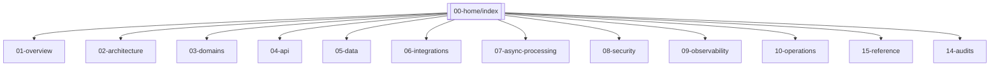

# Mapa de navegación

## Secciones

- [[01-overview/technology-stack]] · [[01-overview/repository-map]]
- [[02-architecture/architecture-overview]] · [[02-architecture/data-flow]] · [[02-architecture/critical-sequences]]
- [[03-domains/index]] — 15 módulos
- [[04-api/index]] — contratos REST, auth, errores
- [[05-data/data-architecture]] — modelo conceptual/lógico/físico, ERD, diccionario
- [[06-integrations/index]] — gateway notificaciones, dataset ejercicios
- [[07-async-processing/workers]] · [[07-async-processing/events]] — outbox
- [[08-security/security-overview]] · [[08-security/threat-model]]
- [[09-observability/observability-overview]]
- [[10-operations/deployment]] · [[10-operations/runbooks/index]]
- [[15-reference/environment-variables]] · [[15-reference/commands]] · [[15-reference/ports]]
- [[14-audits/risks-register]] · [[14-audits/documentation-coverage]]
