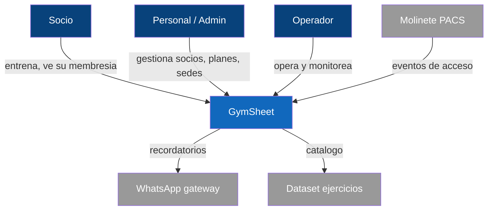

# Contexto del sistema (negocio)

Visión de negocio de quién usa GymSheet y con qué sistemas se integra. Versión técnica con
protocolos: [[02-architecture/system-context]] y [[02-architecture/views/c4-context]].

## Actores

- **Socio**: consulta y registra entrenamientos, ve su plan/membresía vigente y días restantes,
  gestiona su credencial de acceso.
- **Personal / Admin**: alta de socios y membresías, sedes/salas/equipamiento, mantenimiento,
  catálogo y credenciales.
- **Operador / SRE**: despliegue, health, métricas, runbooks.

## Sistemas externos

- **Molinete / PACS** (entrante vía adapter, ADR-0002).
- **Gateway de notificaciones** WhatsApp (saliente).
- **Dataset de ejercicios** externo (saliente, allowlist).
- **Prometheus** (scrape de métricas).

## Límites de alcance

Sin cobros confirmados, sin exportación PDF, sin plataforma de inteligencia económica, sin ingesta
por IA. Ver [[01-overview/assumptions-and-gaps]].
