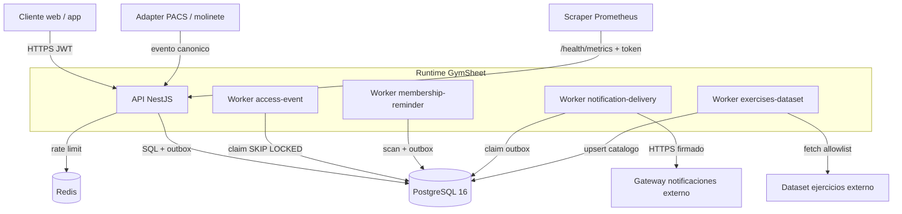

# Arquitectura — visión general

> Nota central de arquitectura. Ver también [[02-architecture/architectural-style]],
> [[02-architecture/containers-and-services]] y las vistas C4 en `02-architecture/views/`.

## Estilo

GymSheet es un **monolito modular NestJS** (una sola imagen Docker) que se ejecuta como
**varios procesos**: una **API HTTP** y **cuatro workers de background** que comparten el mismo
código y esquema. La comunicación asíncrona interna usa un **transactional outbox** en PostgreSQL
(no hay broker externo — ADR-0005). Detalle: [[02-architecture/architectural-style]].

Fuentes reutilizadas (no duplicadas): `docs/architecture/architecture.md`,
`docs/architecture/flows.md`, `docs/architecture/event-driven-production-audit.md`.

## Diagrama de alto nivel

La API escribe mutación y evento en la misma transacción; los workers consumen por polling con
entrega **at-least-once** e idempotencia. Ver [[02-architecture/data-flow]] y
[[07-async-processing/events]].

## Componentes principales

| Componente | Rol | Evidencia |
|---|---|---|
| API HTTP | Transporte, guards globales, 15 módulos de dominio | `src/main.ts`, `src/app.module.ts` |
| Worker access-event | Procesa eventos de dispositivo → decisión de acceso | `src/workers/access-event.*` |
| Worker membership-reminder | Escanea vencimientos → notificación + outbox | `src/workers/membership-reminder.*` |
| Worker notification-delivery | Entrega notificaciones (IN_APP / HTTP gateway / MOCK) | `src/workers/notification-delivery.*` |
| Worker exercises-dataset | Refresca catálogo de ejercicios desde dataset externo | `src/workers/exercises-dataset-refresh.*` |
| Outbox transaccional | Cola de trabajo en PostgreSQL (`integration.outbox_jobs`) | `src/modules/integration/` |
| PostgreSQL 16 | Fuente de verdad (44 models, 10 migraciones) | `docs/db/schema.sql` |
| Redis (opcional) | Contadores de rate limiting compartidos | `src/common/redis/` |
| Gateway (interno) | Endpoints operativos públicos `/gateway/*` | `src/gateway/` |

Detalle: [[02-architecture/containers-and-services]], [[02-architecture/components]].

## Atributos de calidad (resumen)

- **Consistencia**: mutación + evento de dominio en una sola transacción; historial append-only por
  triggers PostgreSQL.
- **Fiabilidad**: workers con `FOR UPDATE SKIP LOCKED`, fencing por `locked_by`+`attempt_count`,
  backoff y dead-letter; errores de polling no matan el proceso.
- **Seguridad**: JWT HS256 con revalidación del principal, autorización por propiedad (ajeno → 404),
  Zod anti mass-assignment, secretos solo por env. Ver [[08-security/security-overview]].
- **Observabilidad**: logs estructurados con `event` + correlation ID, health `live`/`ready`,
  métricas Prometheus. Ver [[09-observability/observability-overview]].
- **Disponibilidad**: readiness degrada a 503 si el esquema está desfasado o Redis requerido cae;
  liveness nunca depende de dependencias.

Detalle y riesgos: [[02-architecture/quality-attributes]], [[02-architecture/architecture-risks]].

## Navegación

- Estilo · [[02-architecture/architectural-style]]
- Contexto · [[02-architecture/system-context]] · [[01-overview/system-context]]
- Contenedores · [[02-architecture/containers-and-services]] · [[02-architecture/deployment-topology]]
- Componentes · [[02-architecture/components]] · [[02-architecture/module-boundaries]] · [[02-architecture/dependency-map]]
- Runtime · [[02-architecture/runtime-topology]]
- Fronteras de confianza · [[02-architecture/trust-boundaries]] · [[02-architecture/communication-matrix]]
- Flujos · [[02-architecture/data-flow]] · [[02-architecture/critical-sequences]]
- Vistas C4 · [[02-architecture/views/c4-context]] · [[02-architecture/views/c4-container]] · [[02-architecture/views/c4-component]]
