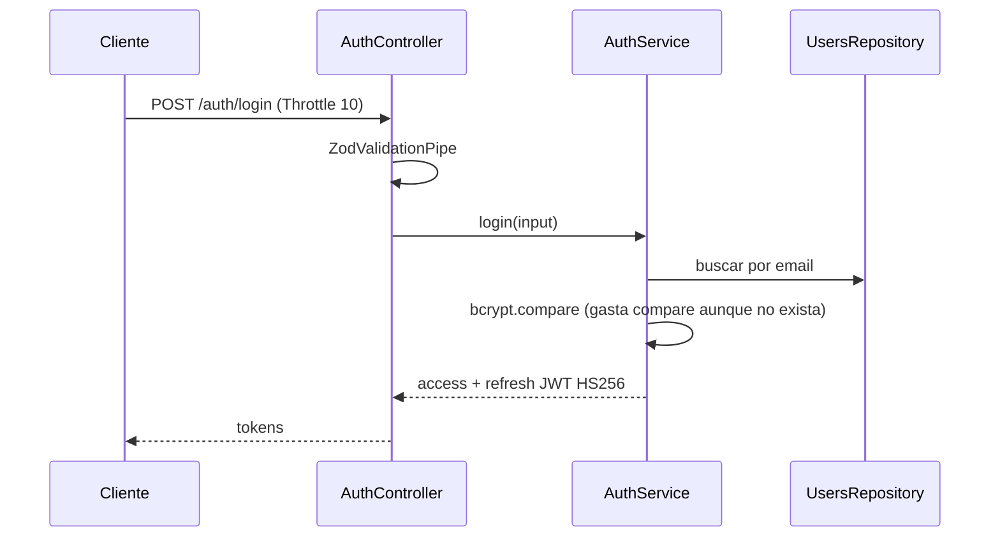
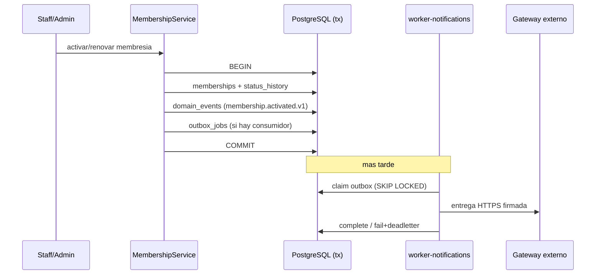
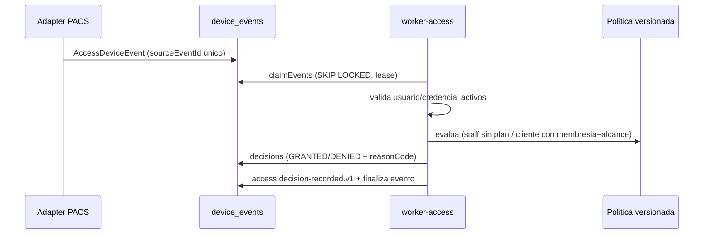
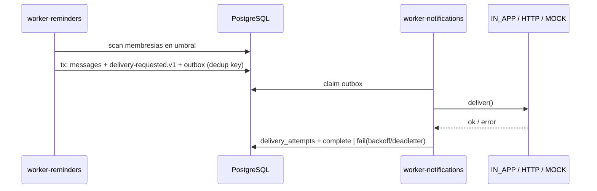

# Secuencias críticas

Cuatro flujos representativos. Base: `docs/architecture/event-driven-production-audit.md` y
`docs/architecture/flows.md`.

## 1. Login

Anti-enumeración temporal: el `compare` se ejecuta incluso sin cuenta. Rutas privadas revalidan el
principal en cada request (`JwtAuthGuard`).

## 2. Renovación / activación de membresía + outbox

Mutación y evento en una sola transacción; repetir el mismo estado no genera historial artificial.

## 3. Evento de acceso físico

Si la decisión ya existe, el worker completa el evento sin duplicarla (idempotencia). `GRANTED` ≠
paso físico confirmado.

## 4. Entrega de notificación

Horas de silencio ajustan `available_at`; el canal externo revalida consentimiento antes de enviar.

Ver [[07-async-processing/events]], [[02-architecture/data-flow]].
