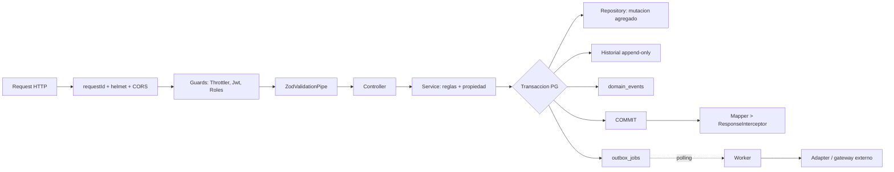

# Flujo de datos

Recorrido de una mutación desde el request hasta el efecto asíncrono. Secuencias concretas en
[[02-architecture/critical-sequences]]; reutiliza `docs/architecture/flows.md`.

## Etapas

1. **Borde HTTP**: middleware de correlation ID, helmet, CORS allowlist, límite de body.
2. **Guards** (orden): `ThrottlerGuard` → `JwtAuthGuard` (revalida principal contra DB) →
   `RolesGuard`.
3. **Validación**: `ZodValidationPipe` descarta campos no declarados (anti mass-assignment).
4. **Service**: aplica reglas de dominio y verifica **propiedad** del recurso (ajeno → 404).
5. **Transacción única**: mutación del agregado + historial + `integration.domain_events`
   (append-only) + `integration.outbox_jobs` cuando hay consumidor asíncrono concreto. Todo commitea
   o revierte junto.
6. **Salida**: nunca se devuelve el modelo ORM; un `*.mapper.ts` produce el DTO y `ResponseInterceptor`
   uniforma la respuesta. Errores por `HttpExceptionFilter` (5xx redactados en prod).
7. **Asíncrono**: un worker reclama el job por polling (SKIP LOCKED), lo procesa de forma idempotente
   y, si aplica, llama al adapter/gateway externo.

Ver [[05-data/data-architecture]], [[07-async-processing/events]].
