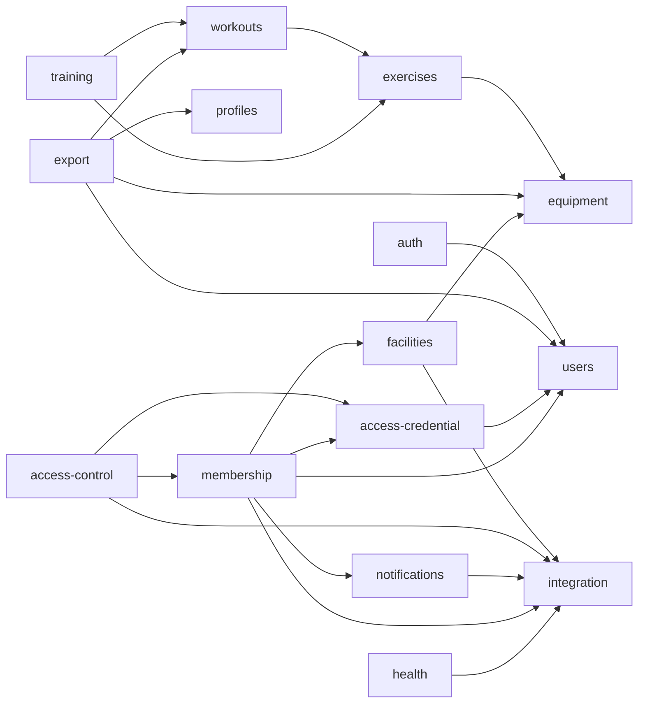

# Mapa de dependencias

Grafo de importación entre módulos de dominio. Detalle tabular y exports en
[[02-architecture/module-boundaries]].

## Lectura

- **Sentido de las flechas**: A → B significa "A importa a B" (A depende de B).
- **Sumideros (hojas)**: `integration`, `users`, `equipment`, `profiles` — no dependen de nadie.
- **`integration`** concentra las flechas entrantes (hub del outbox). Un fallo o cambio de contrato
  aquí impacta 5 módulos.
- **Aciclicidad**: no hay ciclos; ningún `forwardRef()`. El orden de arranque de módulos es
  topológicamente estable.

> Nota: `access-control` (nodo `accontrol`) y `access-credential` (`accred`) viven en el mismo
> directorio; solo el primero se registra en `AppModule`.

Ver [[02-architecture/views/c4-component]] para la vista por capas.
