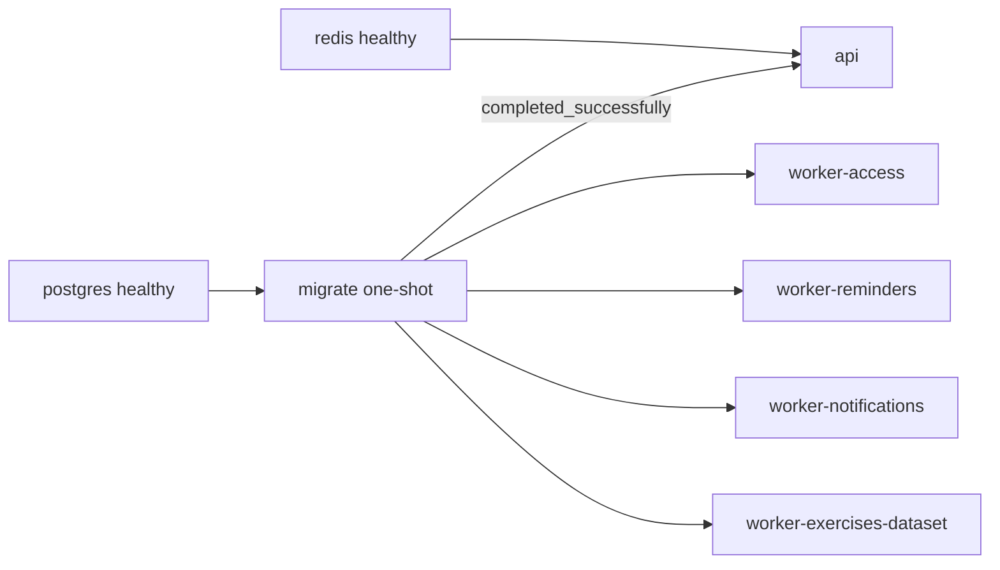

# Topología de despliegue

Fuente: `docker-compose.yml`, `docker-compose.dev.yml`, `Dockerfile`. Servicios:
[[02-architecture/containers-and-services]].

## Orden de arranque (garantizado, no asumido)

`migrate` es one-shot: un exit != 0 se trata como dependencia fallida, así ningún proceso arranca
contra un esquema a medio migrar.

## Por entorno

| Aspecto | Producción (`docker-compose.yml`) | Desarrollo (`docker-compose.dev.yml`) |
|---|---|---|
| `NODE_ENV` | `production` (default) | development (INFERIDO) |
| Redis | requerido (`REDIS_REQUIRED=true`) | opcional |
| Puerto API | publica `${API_PORT:-3001}` → 3000 | local Node en 3000 |
| Seeds | modo `base` | modo `all` (`startupSeedMode`) |
| Endurecimiento | `read_only`, `no-new-privileges`, `tmpfs`, límites de CPU/memoria | relajado |
| Secretos | requeridos, sin default usable (`:?`) | del `.env` local |

> El detalle exacto de `docker-compose.dev.yml` está marcado **INFERIDO** salvo verificación directa;
> el diseño por entorno se deduce de `NODE_ENV`, `startupSeedMode()` y las convenciones del repo.

## Endurecimiento de contenedores (prod)

- `read_only: true` + `tmpfs /tmp` (64m): ningún proceso escribe su FS.
- `security_opt: no-new-privileges:true`.
- Workers con `healthcheck.disable: true` (no sirven HTTP; su liveness es la política de reinicio).
- `stop_grace_period`: API 30s (drenar requests), workers 45s (terminar job en curso).
- Redis sin persistencia; Postgres con volumen `postgres-data` y `schema.sql` solo en primera
  creación.

Ver [[10-operations/deployment]] y `docs/operations/docker-and-messaging.md`.
