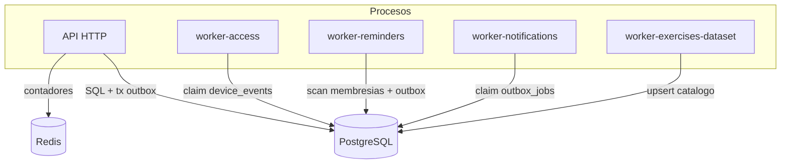

# Topología de runtime

Procesos en ejecución y cómo se comunican en operación normal. Despliegue por entorno:
[[02-architecture/deployment-topology]].

## Modelo de proceso

- **API**: un proceso HTTP (escalable a N réplicas tras un proxy inverso; en compose el puerto fijo
  limita a 1 réplica salvo que se retire el mapeo). El rate limiting es correcto entre réplicas
  gracias a Redis compartido.
- **Workers**: procesos independientes, sin HTTP. Cada uno corre un **loop de polling**
  (`WORKER_POLL_INTERVAL_MS`, por defecto 1s) que reclama trabajo por lotes (`WORKER_BATCH_SIZE`) y
  lo procesa con concurrencia acotada (`WORKER_CONCURRENCY`).

## Coordinación (sin broker)

Toda la coordinación es en PostgreSQL:

- **Claim atómico** con `FOR UPDATE SKIP LOCKED`: varios workers del mismo tipo no se pisan.
- **Lease/fencing**: `locked_by` + `attempt_count` + `WORKER_LOCK_TIMEOUT_MS`; un worker lento cuyo
  lease expiró no puede sobrescribir un job re-reclamado.
- **Reintentos**: backoff hasta `WORKER_MAX_ATTEMPTS`, luego dead-letter.

## Apagado

`enableShutdownHooks()` (API) y `AbortController` sobre `SIGTERM`/`SIGINT` (workers). Los workers
tienen `stop_grace_period` mayor que la API (45s vs 30s) para terminar el job que retienen antes de
morir. Ver [[02-architecture/critical-sequences]] y `docs/architecture/flows.md` (ciclo de vida).
