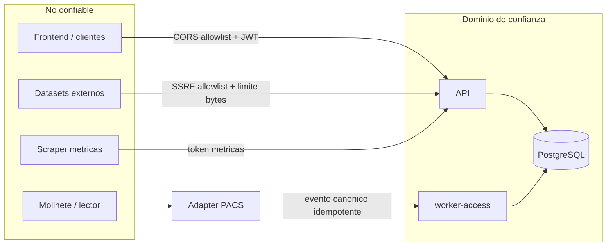

# Fronteras de confianza

Puntos donde datos no confiables cruzan hacia el dominio. Ver [[08-security/security-overview]].

## Bordes

### 1. Borde de acceso físico / biometría (ADR-0002)

El frontend **nunca** habla con el molinete. Un adapter del fabricante traduce a un
`AccessDeviceEvent` canónico con `sourceEventId` (unicidad → idempotencia); el worker de acceso
evalúa una política versionada. Reglas:

- El dominio no importa SDKs del fabricante; el API web no abre el molinete.
- No se guardan imágenes, minucias ni templates biométricos, solo una **referencia opaca**.
- El PIN se persiste como hash y nunca se escribe en colas, eventos, auditoría ni logs.
- Autenticación (hardware) ≠ autorización (GymSheet decide según usuario/plan/sede/punto).
- El mock queda bloqueado en producción (`ACCESS_MOCK_ENABLED` prohibido si `NODE_ENV=production`).

### 2. Gateway de notificaciones externo (saliente)

Entrega vía `HTTP_GATEWAY` exige HTTPS + host en `NOTIFICATION_GATEWAY_ALLOWED_HOSTS` + secreto de
firma (validado en `env.ts`). `MOCK` prohibido en producción. Protección SSRF por allowlist.

### 3. Dataset de ejercicios (saliente)

Fetch a hosts en `EXERCISES_DATASET_ALLOWED_HOSTS` con timeout y `MAX_RESPONSE_BYTES`. Import de
media exige confirmación explícita de licencia.

### 4. Scraper de métricas (entrante)

`/health/metrics` protegible con `METRICS_SCRAPE_TOKEN` (guard `MetricsScrapeGuard`) o restricción de
red. Las sondas health nunca dependen del backend de rate limiting.

### 5. Borde HTTP público

CORS por allowlist (`CORS_ORIGINS`), helmet, límite de body, rate limiting (auth más estricto),
JWT HS256 con revalidación del principal en cada request, Zod anti mass-assignment. Acceso a recurso
ajeno responde **404, no 403**.

Ver [[02-architecture/communication-matrix]].
