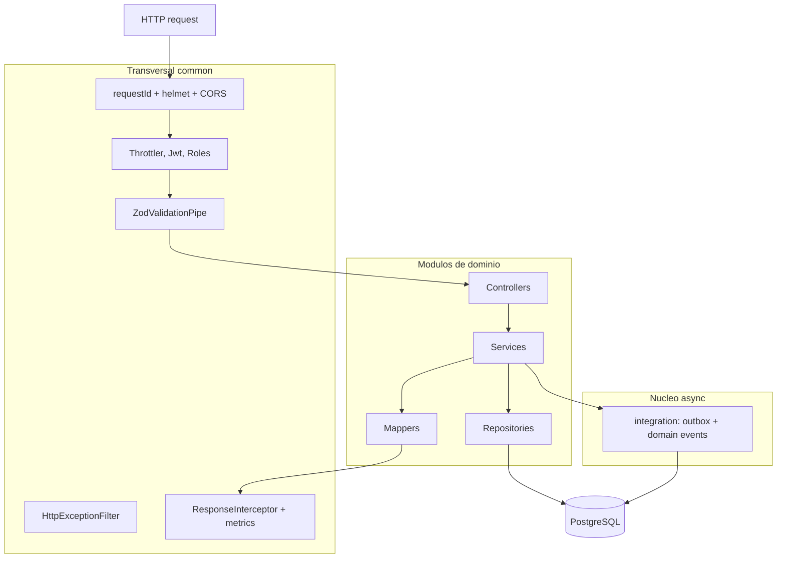

# Vista C4 — Nivel 3 (Componentes de la API)

Componentes internos de la API por capas. Detalle: [[02-architecture/components]] y
[[02-architecture/module-boundaries]].

## Explicación

El flujo entra por componentes transversales de `common/` (guards en orden Throttler → Jwt → Roles),
pasa a `controller → service → repository` dentro de cada módulo, y las escrituras asíncronas se
canalizan por `integration` (outbox + domain events) en la misma transacción. Los mappers evitan
devolver modelos ORM. Ver [[02-architecture/data-flow]].
