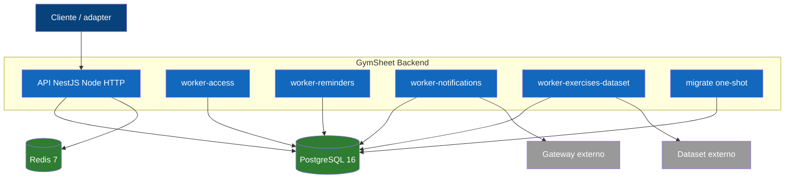

# Vista C4 — Nivel 2 (Contenedores)

Procesos desplegables y datastores. Detalle: [[02-architecture/containers-and-services]].

## Explicación

Todos los contenedores de aplicación comparten una imagen y difieren en el `command`. `migrate` corre
antes que todo (one-shot). Los workers no exponen HTTP y se coordinan solo por PostgreSQL
(`SKIP LOCKED`). Redis solo guarda contadores de rate limiting. Ver
[[02-architecture/deployment-topology]] y siguiente nivel [[02-architecture/views/c4-component]].
