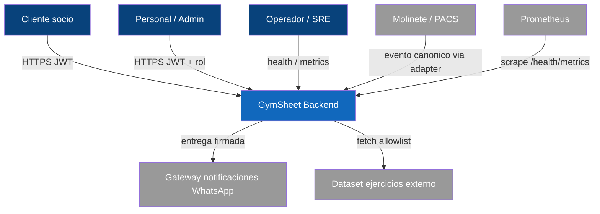

# Vista C4 — Nivel 1 (Contexto)

Aproximación C4 con `flowchart` de Mermaid. El sistema como caja negra frente a actores y sistemas
externos. Detalle: [[02-architecture/system-context]].

## Explicación

GymSheet gestiona entrenamientos, ejercicios, membresías, control de acceso físico/biometría y
notificaciones. Recibe eventos de acceso solo a través de un adapter (nunca del molinete directo,
ADR-0002) y envía notificaciones a un gateway externo. No ingiere datos por agentes de IA.

Siguiente nivel: [[02-architecture/views/c4-container]].
