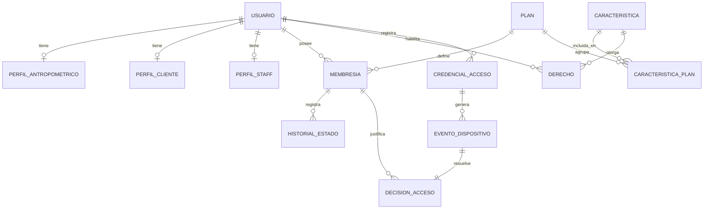
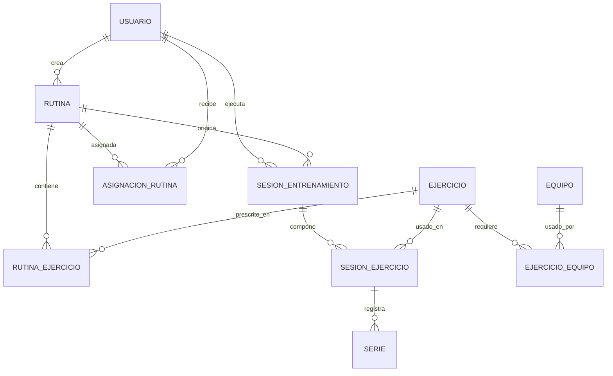
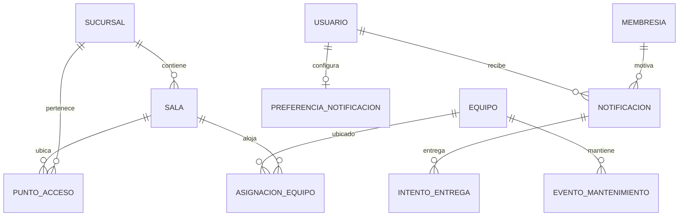

# Modelo conceptual de datos

Entidades de negocio y relaciones principales, sin tipos físicos ni claves. Simplificado por dominio.

## Núcleo: personas, membresías y acceso

Un **usuario** puede ser cliente, staff o ambos. Compra **membresías** de un **plan**; el plan
concede **características** que se materializan como **derechos** (entitlements) del usuario. El acceso
físico se registra con **credenciales** que generan **eventos de dispositivo**, cada uno resuelto en
una **decisión de acceso**.

## Entrenamiento

Un **coach** crea **rutinas** con **ejercicios** prescritos y las **asigna** a clientes. La ejecución
real vive en **sesiones** con sus **ejercicios** y **series** (peso, reps, RIR).

## Instalaciones y notificaciones

Las **sucursales** contienen **salas** y **puntos de acceso**; los **equipos** se asignan a salas y
tienen **mantenimientos**. Las **notificaciones** (recordatorios de expiración) se envían al usuario y
registran **intentos de entrega**.

## Notas

- ERD global unificado y por dominio: [[entity-relationship-model]].
- Diagramas de dominio de negocio: ver [[03-domains/membership/index|Membership]],
  [[03-domains/access-control/index|Access Control]], [[03-domains/training/index|Training]].
