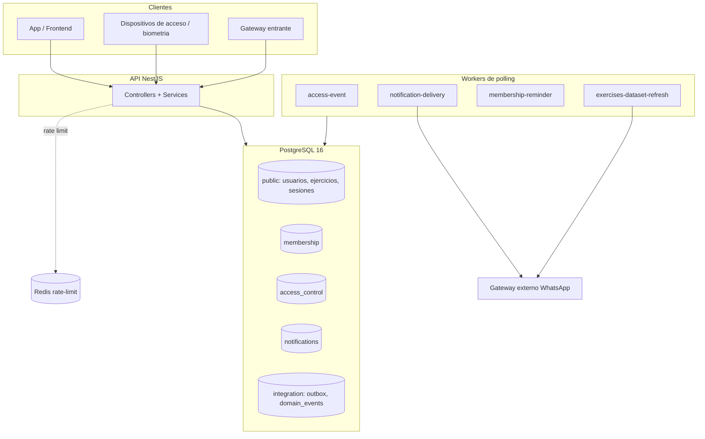

# Arquitectura de datos

Vista de alto nivel de dónde vive el estado del backend GymSheet y cómo se conecta.

## Almacenes

| Almacén | Rol | Persistencia | Notas |
|---|---|---|---|
| **PostgreSQL 16** | Base de datos primaria (fuente de verdad) | Durable | Único almacén transaccional. Esquema por migraciones versionadas (`src/database/migrations/`). Multi-esquema: `public`, `facilities`, `membership`, `access_control`, `notifications`, `integration`, `training`, `profile`, `media`. |
| **Redis** (opcional) | Rate limiting compartido en multi-instancia | Efímero | Solo contadores de throttling (`REDIS_URL` + `REDIS_REQUIRED`). No es fuente de verdad. Las sondas de health nunca dependen de él para readiness del negocio. |
| **Gateway externo** (HTTP) | Entrega de notificaciones (WhatsApp) | N/A (integración) | No almacena estado del backend; boundary de adaptador. Consumido por el worker de notificaciones. |

No hay caché de aplicación, ni colas externas (RabbitMQ/Kafka): la mensajería asíncrona se resuelve
con el patrón **transactional outbox** dentro de PostgreSQL (ver [[transactions]] y ADR-0005).

## Conexiones

- La **API** (`src/main.ts`) y cada **worker** (`src/workers/`) abren su propio pool Sequelize contra
  la misma PostgreSQL. Pool y `statement_timeout` se configuran por entorno (`src/config/env.ts`).
- Los workers **compiten por trabajo** con claim atómico (`SELECT ... FOR UPDATE SKIP LOCKED`) sobre
  las tablas cola (`integration.outbox_jobs`, `access_control.device_events`).
- Redis se conecta solo si `REDIS_URL` está presente; con `REDIS_REQUIRED=true` su caída degrada la
  readiness del rate limiting, no la liveness.

## Diagrama

El diagrama muestra que **todo el estado durable converge en PostgreSQL**; Redis y los gateways son
periféricos. API y workers son procesos separados sobre la misma base.

## Referencias

- Modelo físico: [[physical-data-model]]
- Inventario de almacenes: [[data-stores]]
- Límites transaccionales y outbox: [[transactions]]
- Índices y patrones de consulta: [[indexing-and-query-patterns]]
