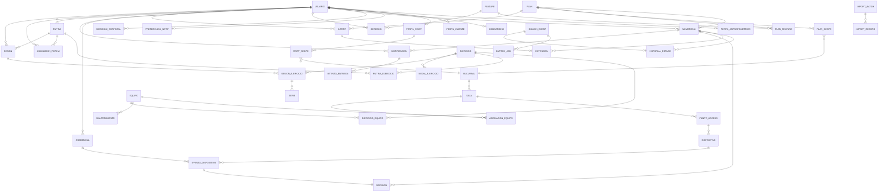

# Modelo entidad-relación (ERD global)

ERD global simplificado del backend. Por legibilidad, los tipos físicos y las columnas se omiten;
`USUARIO` es el hub central. Los ERDs de detalle por dominio están en [[conceptual-data-model]].

## Lectura

- **`USUARIO`** concentra la mayoría de relaciones (identidad, membresías, acceso, entrenamiento,
  notificaciones). Es el principal punto de re-validación de autorización.
- **`MEMBRESIA`** es el eje del negocio: nace de un `PLAN`, evoluciona por `HISTORIAL_ESTADO` y
  `EXTENSION`, y habilita `DECISION` de acceso y `NOTIFICACION`.
- **`DOMAIN_EVENT`** es la espina dorsal de la mensajería: alimenta `OUTBOX_JOB` (entrega asíncrona) y
  respalda cada `HISTORIAL_ESTADO`.
- **`EVENTO_DISPOSITIVO` → `DECISION`** es 1:1 (una decisión por evento).

> [!note] Hay ERDs por dominio
> Diagramas más específicos y con atributos viven en [[conceptual-data-model]] (núcleo, entrenamiento,
> instalaciones/notificaciones) y en las notas de dominio [[03-domains/membership/index|Membership]],
> [[03-domains/access-control/index|Access Control]], [[03-domains/training/index|Training]].

## Referencias

- Catálogo tabular de relaciones con ON DELETE: [[relationship-catalog]]
- Modelo físico: [[physical-data-model]]
