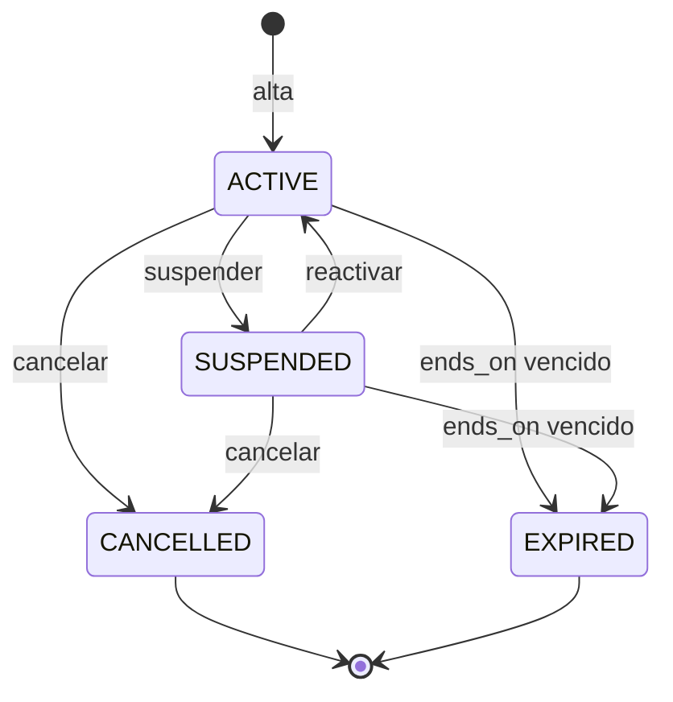
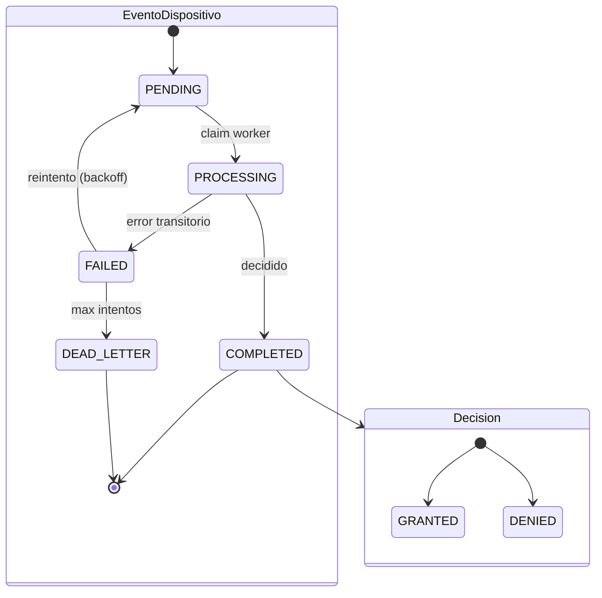
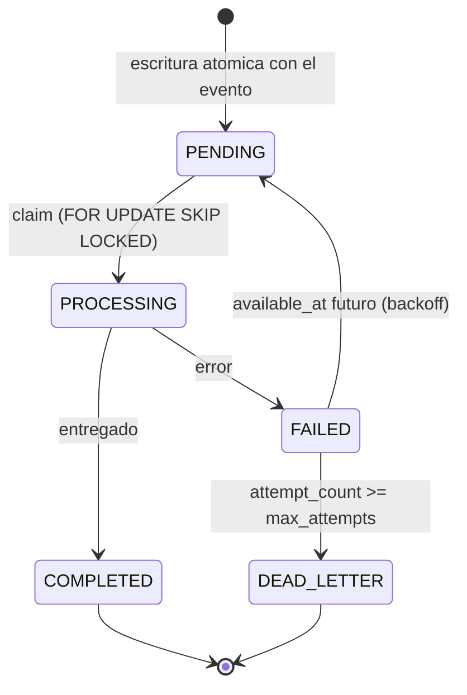
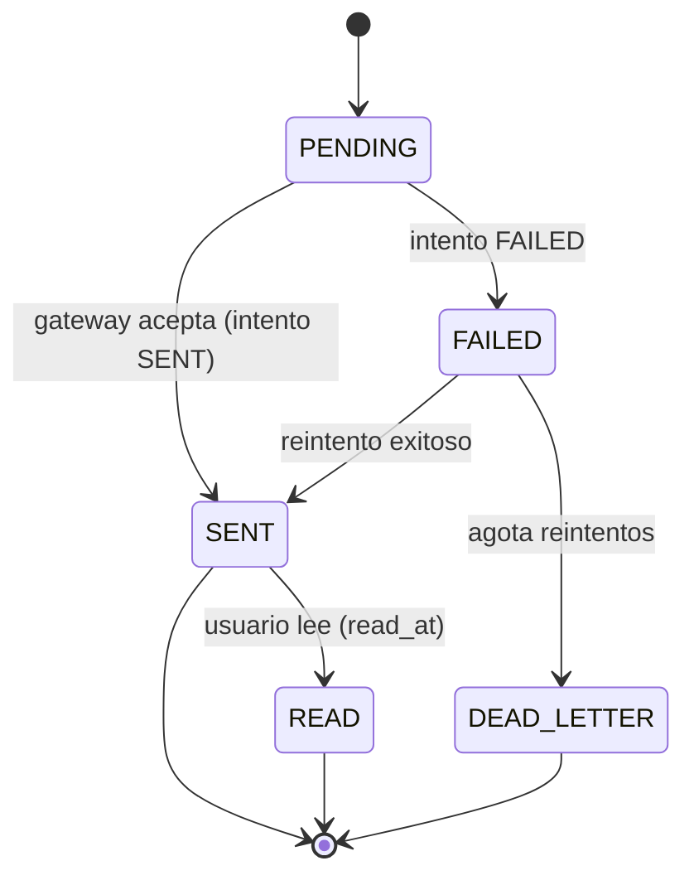

# Modelos de estado y ciclo de vida

Máquinas de estado con evidencia en CHECK/enum. Los estados provienen de las restricciones físicas;
las **transiciones** se marcan como INFERIDO cuando no hay un mapa de transición explícito en el
esquema (solo el conjunto de estados válidos).

## Membresía (`membership.memberships.status`)

Estados con evidencia: CHECK `ck_memberships_status` = ACTIVE, SUSPENDED, CANCELLED, EXPIRED.
Cada cambio se registra en `membership.status_history` (append-only) que además prohíbe `from = to`.

Estados = VERIFICADO (CHECK). Aristas concretas = **INFERIDO** (el esquema solo valida el conjunto y
`from<>to`; no codifica el grafo de transición). `status_history.to_status` acepta cualquiera de los 4.

## Decisión de acceso (`access_control.decisions.outcome` + evento)

El evento de dispositivo (`device_events.queue_status`) atraviesa la cola; su resolución produce
exactamente una decisión GRANTED/DENIED.

`queue_status` VERIFICADO (CHECK: PENDING, PROCESSING, COMPLETED, FAILED, DEAD_LETTER). `outcome`
VERIFICADO (CHECK: GRANTED, DENIED). El motivo (`reason_code`) usa el enum lógico
`AccessDecisionReason`. Transiciones de cola = INFERIDO (patrón de worker + índice de claim).

## Outbox job (`integration.outbox_jobs.status`)

Estados VERIFICADO (CHECK `ck_outbox_status`). `max_attempts` 1–20, `available_at` implementa backoff.
Transiciones = INFERIDO (patrón outbox, ADR-0005). Ver [[transactions]].

## Notificación (`notifications.messages.status`) e intento de entrega

`messages.status` VERIFICADO (CHECK: PENDING, SENT, FAILED, DEAD_LETTER, READ). Cada
`delivery_attempts` tiene status VERIFICADO (CHECK: SENT, FAILED) con `attempt_number` único
creciente. Transiciones READ/DEAD_LETTER = INFERIDO.

## Otros ciclos con evidencia (resumen)

- **Onboarding** (`profile.onboarding.status`): NOT_STARTED → IN_PROGRESS → COMPLETED / REQUIRES_UPDATE
  (CHECK, pasos 1–5). Transiciones INFERIDO.
- **Intent de membresía** (`membership.intents.status`): PENDING_PAYMENT → CONFIRMED / CANCELLED /
  EXPIRED (CHECK). Confirmación genera `extensions` 1:1.
- **Import batch** (`legacy_import_batches.status`): VALIDATING → READY → IMPORTING → COMPLETED /
  COMPLETED_WITH_ERRORS / FAILED (CHECK).
- **Credencial** (`credentials.status`): ACTIVE → SUSPENDED → REVOKED (CHECK).
- **Sesión de entrenamiento** (`sesiones_entrenamiento.estado`): EN_PROGRESO → FINALIZADA / CANCELADA
  (CHECK; una activa por usuario).

## Referencias

- [[transactions]] · [[physical-data-model]] · [[entities/outbox-job]] · [[entities/notification]]
