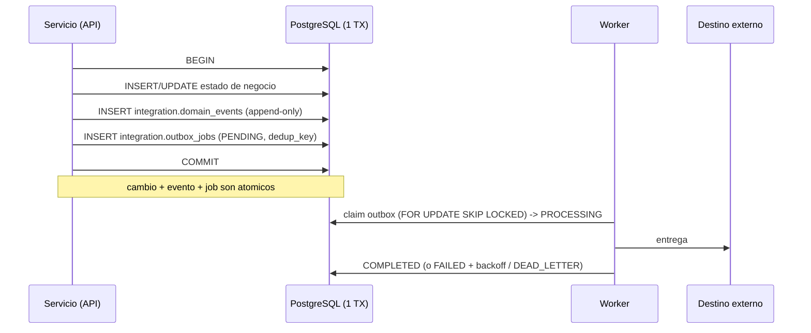

# Transacciones y consistencia

Límites transaccionales del backend. Regla base (`.claude/rules/10-backend-architecture.md`): toda
operación multi-tabla que deba ser atómica usa una transacción Sequelize; el trabajo asíncrono va por
el **outbox transaccional**.

## Patrón transactional outbox (ADR-0005)

El corazón de la consistencia entre cambio de estado y mensajería.

**Garantía:** o se persiste el cambio de negocio **y** su evento/job, o nada. Nunca se emite un evento
sin que el cambio exista (ni viceversa), porque comparten una sola transacción. La entrega al exterior
es *at-least-once* con deduplicación por `deduplication_key` (UNIQUE).

## Límites transaccionales por caso

| Operación | Tablas en la TX | Atomicidad requerida |
|---|---|---|
| Cambio de estado de membresía | `memberships` + `status_history` + `domain_events` + `outbox_jobs` | Estado, historial y evento juntos (historial append-only ligado 1:1 a evento) |
| Confirmación de intent | `intents` + `extensions` + `memberships` (ends_on) + evento/outbox | Extender vigencia y registrar extensión 1:1 |
| Decisión de acceso | `device_events` (→COMPLETED) + `decisions` (1:1) | Resolver el evento y grabar su única decisión |
| Entrega de notificación | `messages` (status) + `delivery_attempts` (append) | Registrar intento y actualizar estado |
| Import legacy (por lote) | `legacy_import_records` + entidades destino | Idempotencia por `(batch, entity, record_id)` |
| Emisión de evento de dominio | `domain_events` + `outbox_jobs` + agregado | Base del outbox |

## Concurrencia y claim de trabajo

- **Colas** (`outbox_jobs`, `device_events`): claim con `SELECT ... FOR UPDATE SKIP LOCKED` +
  `locked_at`/`locked_by`, evita que dos workers tomen el mismo ítem. Índices de claim en
  [[indexing-and-query-patterns]].
- **Backoff:** `available_at` futuro reprograma el reintento; `attempt_count`/`max_attempts` limitan
  y derivan a `DEAD_LETTER`.
- **Idempotencia de escritura:** conflictos de UNIQUE (`deduplication_key`, claves de idempotencia) se
  traducen a `ConflictException` (409), no a 500 (regla 10-backend-architecture).

## Invariantes garantizados por la base (no solo por la app)

- **Exclusión mutua temporal** vía índices únicos parciales: 1 sesión activa/usuario, 1 asignación de
  rutina activa/(rutina,cliente), 1 asignación de equipo activa, 1 PIN activo/usuario.
- **Append-only por trigger:** `domain_events` y `membership.status_history` rechazan UPDATE/DELETE.
- **Coherencia de material** de credenciales y **consentimiento** de canal externo por CHECK.

## Consistencia eventual

Entre el commit del outbox y la entrega externa hay una ventana; el estado observable del backend es
consistente de inmediato, y la propagación al exterior (gateway, dispositivos) es eventual con
reintentos. No hay transacciones distribuidas.

## Referencias

- [[state-and-lifecycle-models]] · [[entities/outbox-job]] · [[indexing-and-query-patterns]] · ADR-0005
