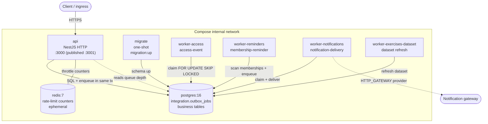

# Docker, messaging and workers — operations runbook

This runbook documents how the containerized stack is built, run, scaled,
diagnosed and deployed, and how the asynchronous messaging (transactional
outbox) behaves in operation. The messaging technology decision is recorded in
[ADR-0005](../decisions/ADR-0005-messaging-transactional-outbox.md).

## Service topology



Communication rules:

- Producers and consumers are decoupled through `integration.outbox_jobs`. The
  API never calls a worker; it enqueues in the **same transaction** as the
  business change (no dual-write, no lost message).
- Workers reach only PostgreSQL (and, for `worker-notifications` with the
  `HTTP_GATEWAY` provider, an allowlisted outbound gateway). They serve no HTTP.
- Only the `api` port is published. Postgres and Redis stay on the internal
  network. In dev, Postgres is published for tooling (`docker-compose.dev.yml`).
- Startup is gated: `postgres` + `redis` healthy → `migrate` completes → `api`
  and workers start. An instance never serves traffic against an older schema.

## Queues

| Queue (`queue_name`)      | Producer                         | Consumer                    |
| ------------------------- | -------------------------------- | --------------------------- |
| `access.decisions`        | access device-event ingestion    | `worker-access`             |
| `membership.reminders`    | reminder scan / membership events| `worker-reminders`          |
| `notifications.delivery`  | notification creation            | `worker-notifications`      |
| exercises dataset refresh | scheduled interval               | `worker-exercises-dataset`  |

Delivery semantics (implemented in `src/modules/integration/` and
`src/workers/`): at-least-once with logical exactly-once via a per-worker lease
check, bounded concurrency (`WORKER_CONCURRENCY`) and prefetch
(`WORKER_BATCH_SIZE`), exponential backoff on failure, `DEAD_LETTER` after
`WORKER_MAX_ATTEMPTS`, and idempotency through the unique `deduplication_key`
plus idempotent handlers.

## Commands

### Production-like stack

```bash
# Build all images and start the full stack (postgres, redis, migrate, api, workers)
docker compose up -d --build

# Follow logs for one service
docker compose logs -f api
docker compose logs -f worker-notifications

# Stop / tear down (keep data)
docker compose down

# Tear down including the database volume (destructive)
docker compose down -v
```

### Development (hot reload)

```bash
# API hot-reloads on ./src changes; workers run from TypeScript via ts-node
docker compose -f docker-compose.yml -f docker-compose.dev.yml up --build
```

### Local (no Docker) — unchanged

```bash
yarn install --frozen-lockfile
yarn migration:up
yarn start:dev
yarn worker:notifications   # etc.
```

## Horizontal scaling of workers

Workers are stateless consumers. `FOR UPDATE SKIP LOCKED` guarantees that two
replicas never claim the same job, so scaling needs **no code change**:

```bash
docker compose up -d --scale worker-notifications=3 --scale worker-access=2
```

Because workers publish no host ports and their healthcheck is disabled (process
liveness is covered by the restart policy), any replica count is valid. Size the
count against `gym_sheet_outbox_backlog_age_seconds` and the PostgreSQL pool
metrics — do not scale workers past what `DB_POOL_MAX` and the database can
absorb.

The `api` service publishes a fixed host port, so scaling it beyond one replica
requires removing that mapping and fronting the service with a reverse proxy on
the compose network. Shared Redis already makes rate limiting correct across API
replicas.

## Health checks

| Service | Check | Notes |
| ------- | ----- | ----- |
| `api` | `GET /health/live` via curl (Docker HEALTHCHECK) | Liveness only; readiness depends on DB/Redis and must not trigger restarts. |
| `postgres` | `pg_isready` | Gates dependents. |
| `redis` | `redis-cli ping` | Gates dependents. |
| workers | disabled | No HTTP surface; the restart policy covers process liveness. |
| readiness | `GET /health/ready` | DB reachable + migrations applied + Redis (if configured). 503 otherwise. |

## Diagnostics

```bash
# Validate merged compose configuration (prod and dev)
docker compose config
docker compose -f docker-compose.yml -f docker-compose.dev.yml config

# Container resource usage
docker stats --no-stream

# Queue depth and backlog age (requires METRICS_SCRAPE_TOKEN if set)
curl -s http://localhost:3001/api/v1/health/metrics | grep gym_sheet_outbox

# Inspect dead-lettered jobs directly (read-only)
docker compose exec postgres psql -U "$DB_USER" -d "$DB_NAME" -c \
  "SELECT queue_name, count(*) FROM integration.outbox_jobs \
   WHERE status='DEAD_LETTER' GROUP BY queue_name;"
```

## Maintenance — outbox retention

`COMPLETED` outbox jobs are append-only and accumulate over time. A one-shot
command prunes them; it is **opt-in and dry-runs by default**, and only ever
deletes `COMPLETED` jobs older than `OUTBOX_RETENTION_DAYS` (default 30).
PENDING, PROCESSING, FAILED and DEAD_LETTER jobs are never eligible.

```bash
# Report how many COMPLETED jobs are eligible (no deletion)
yarn db:outbox:prune            # local (ts-node)
node dist/workers/outbox-prune.command.js          # inside the runtime image

# Actually delete eligible COMPLETED jobs, in bounded batches
yarn db:outbox:prune --apply
node dist/workers/outbox-prune.command.js --apply   # in a container / cron
```

Run it from an external scheduler (host cron, Kubernetes CronJob) against the
runtime image; it is intentionally not wired as an always-on worker. Deletion
uses `FOR UPDATE SKIP LOCKED`, so it does not contend with the workers.

## Resilience testing (manual)

1. **Retry + backoff:** force a handler failure (e.g. point `NOTIFICATION_GATEWAY_URL`
   at an unreachable allowlisted host) and observe `status` moving PENDING →
   FAILED with a growing `available_at`, then recovery when the dependency
   returns.
2. **Dead-letter:** let a job exceed `WORKER_MAX_ATTEMPTS`; confirm it lands in
   `DEAD_LETTER` and the `gym_sheet_outbox_jobs{status="DEAD_LETTER"}` gauge and
   the dead-letter alert fire.
3. **Duplicate prevention:** enqueue twice with the same `deduplication_key`;
   confirm the unique constraint yields a single job (409/idempotent path).
4. **Crash recovery:** `docker compose kill worker-notifications` mid-job; after
   `WORKER_LOCK_TIMEOUT_MS` another replica (or the restarted worker) reclaims
   the leased job. No job is lost.
5. **Graceful shutdown:** `docker compose stop worker-access`; logs must show
   `worker.shutdown_requested` then `worker.stopped` within `stop_grace_period`.
6. **Dependency outage:** stop `postgres`; `api` liveness stays 200 while
   readiness returns 503. Restarting Postgres restores readiness without an API
   restart loop.

## Deployment compatibility

The production image (`Dockerfile` default `runtime` target) is unchanged:
multi-stage, `node:22-alpine`, non-root `node` user, read-only root filesystem,
`no-new-privileges`, `tini` as PID 1, and a liveness-only healthcheck. The
`development` target is additive and never the default. Existing deployment
flows (`docker compose up -d --build`, the same env-var contract) continue to
work as before.
